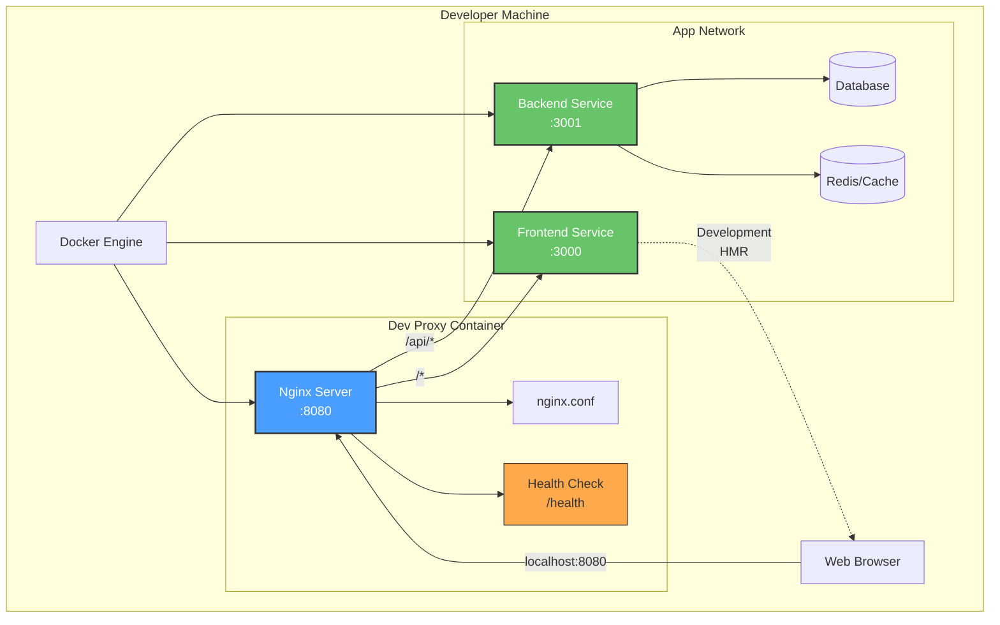
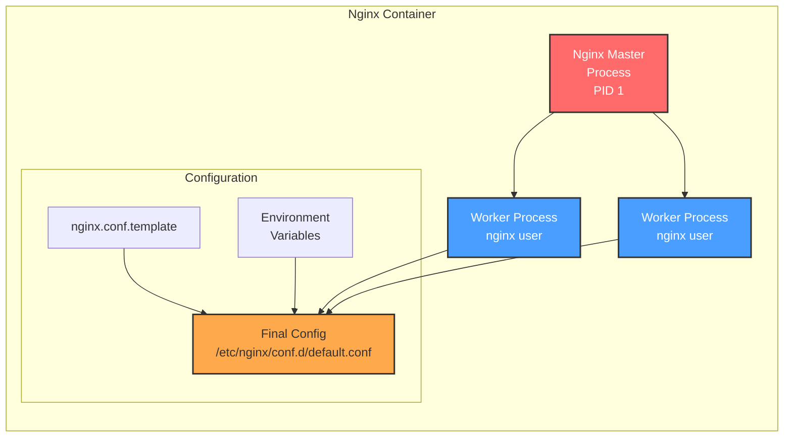
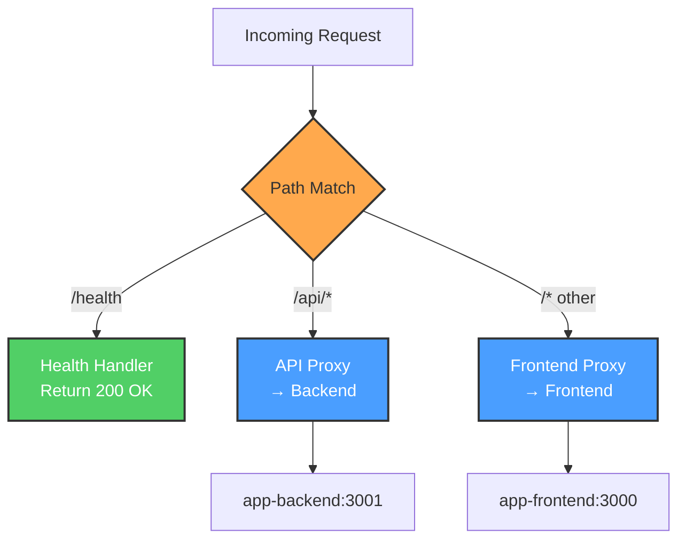
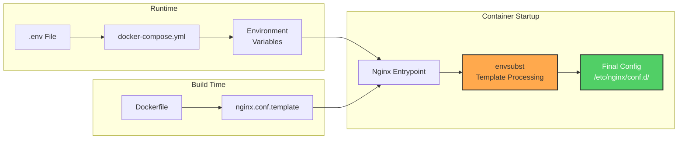
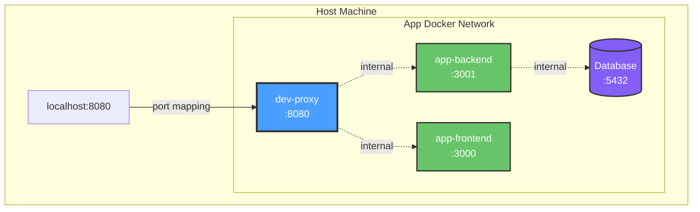
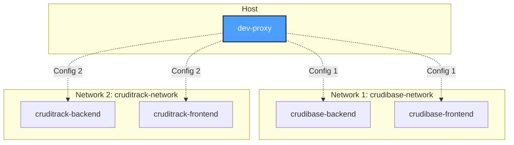
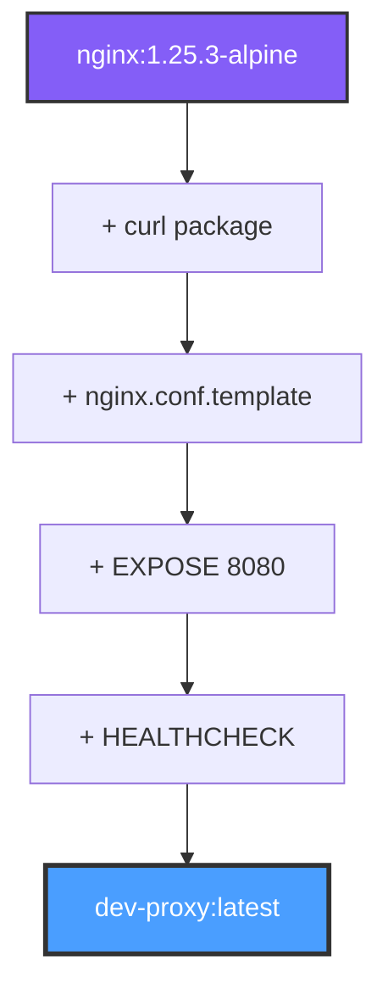
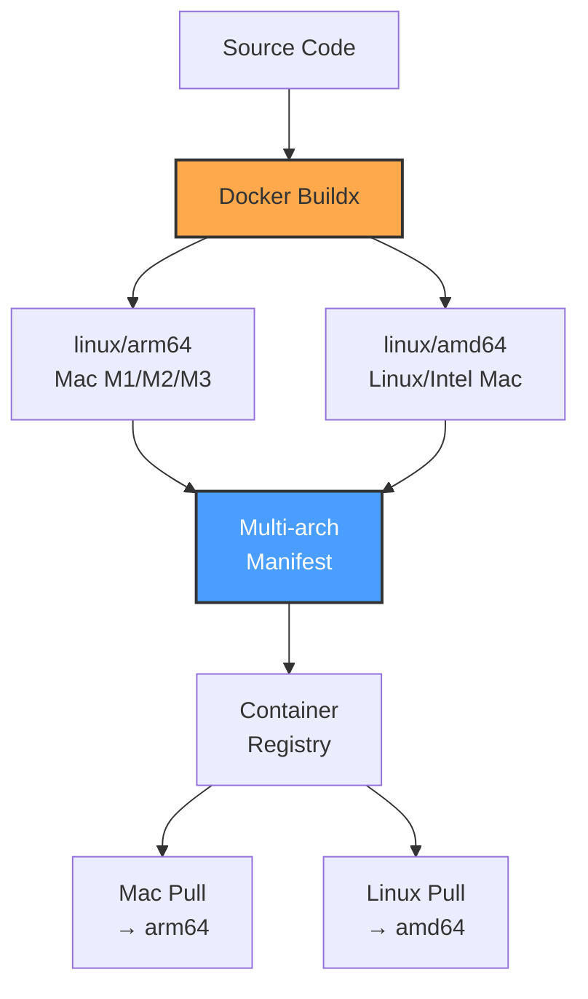
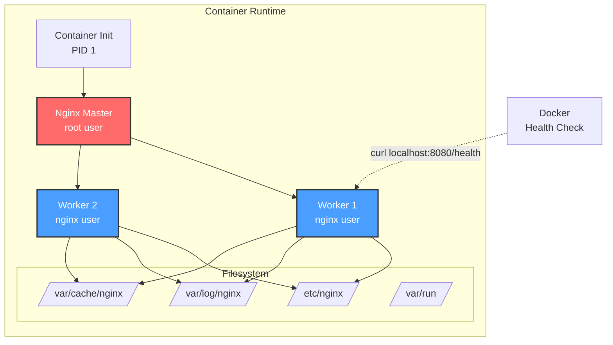

# Architecture

This page describes the architecture of the Dev Proxy system, including its components, design decisions, and deployment patterns.

## Table of Contents

- [Overview](#overview)
- [System Architecture](#system-architecture)
- [Component Architecture](#component-architecture)
- [Network Architecture](#network-architecture)
- [Container Architecture](#container-architecture)
- [Design Decisions](#design-decisions)

## Overview

Dev Proxy is a containerized nginx reverse proxy designed for local development. It provides a single entry point for accessing both frontend and backend services of a containerized application.

### Key Principles

1. **Simplicity** - Minimal configuration, maximum utility
2. **Flexibility** - Works with any containerized app following standard patterns
3. **Portability** - Multi-arch builds support both Mac and Linux development
4. **Isolation** - Runs in its own container on the app's network

## System Architecture

## Component Architecture

### 1. Nginx Reverse Proxy

The core component is nginx running in Alpine Linux.

**Key Features:**

- **Master Process**: Runs as root (standard for containerized nginx)
- **Worker Processes**: Run as unprivileged `nginx` user
- **Template Processing**: Environment variables substituted at startup
- **Health Monitoring**: Built-in health check endpoint

### 2. Routing Layer

Request routing is based on URL path patterns.

**Routing Rules:**

1. `/health` - Local health check (no proxy)
2. `/api/*` - Proxied to backend with path rewrite (strips `/api`)
3. `/*` - All other paths proxied to frontend

### 3. Configuration Layer

## Network Architecture

### Docker Network Topology

**Network Characteristics:**

- **External Network**: App's existing Docker network (configured via `APP_NETWORK`)
- **Port Mapping**: Only dev-proxy exposes port to host
- **Internal Communication**: All service-to-service traffic stays within Docker network
- **DNS Resolution**: Docker's built-in DNS resolves service names

### Multi-App Support

Dev Proxy can connect to different app networks by changing configuration:

**Note**: Dev Proxy can only connect to one app network at a time. Switch by updating `.env` and restarting.

## Container Architecture

### Image Layers

**Image Size**: ~43MB (Alpine-based)

### Multi-Architecture Build

### Runtime Architecture

## Design Decisions

### 1. Why nginx?

- **Proven**: Battle-tested reverse proxy
- **Lightweight**: Small footprint, low resource usage
- **Fast**: Excellent performance for proxying
- **Simple**: Well-understood configuration

### 2. Why Alpine Linux?

- **Small**: Minimal base image (~7MB base)
- **Secure**: Smaller attack surface
- **Fast**: Quick to build and deploy

### 3. Why HTTP only (no HTTPS)?

- **Local Dev**: Designed for localhost use only
- **Simplicity**: No certificate management needed
- **Performance**: Lower overhead for development

**Important**: Never expose this proxy to external networks or production environments.

### 4. Why Template-Based Config?

- **Flexibility**: Same image works for any app
- **Simplicity**: No rebuilding to change configuration
- **Portability**: Configuration via environment variables

### 5. Why External Network?

- **Integration**: Connects to existing app infrastructure
- **Isolation**: Doesn't require app changes
- **Flexibility**: Easy to add/remove without affecting app

## Port Standardization

Dev Proxy assumes standardized internal ports:

| Service | Port | Protocol |
|---------|------|----------|
| Frontend | 3000 | HTTP |
| Backend | 3001 | HTTP |
| Proxy (external) | 8080 | HTTP |
| Proxy (internal) | 8080 | HTTP |

**Benefits:**

- Consistent configuration across all apps
- Predictable routing rules
- Simplified documentation

## Related Documentation

- [Request Flow](Request-Flow.md) - See how requests flow through the system
- [Configuration](Configuration.md) - Detailed configuration options
- [Build Process](Build-Process.md) - How images are built and deployed
- [Security](Security.md) - Security architecture and considerations
