# Build Process

This page documents the build, test, and deployment workflows for Dev Proxy, including detailed diagrams and examples.

## Table of Contents

- [Overview](#overview)
- [Build Scripts](#build-scripts)
- [Local Build Workflow](#local-build-workflow)
- [Multi-Architecture Build](#multi-architecture-build)
- [Registry Push Workflow](#registry-push-workflow)
- [Testing Workflow](#testing-workflow)
- [Complete Build Pipeline](#complete-build-pipeline)

## Overview

Dev Proxy provides several build scripts for different use cases:

| Script | Purpose | Output | Registry |
|--------|---------|--------|----------|
| `build-local.sh` | Quick local build | Single platform image | No |
| `build-multiarch.sh` | Multi-platform build | arm64 + amd64 images | Optional |
| `push-to-registry.sh` | Push to registry | Multi-arch manifest | Yes |
| `build-all.sh` | Complete pipeline | All of the above | Optional |
| `test.sh` | Run tests | Test results | No |

## Build Scripts

### Script Relationships

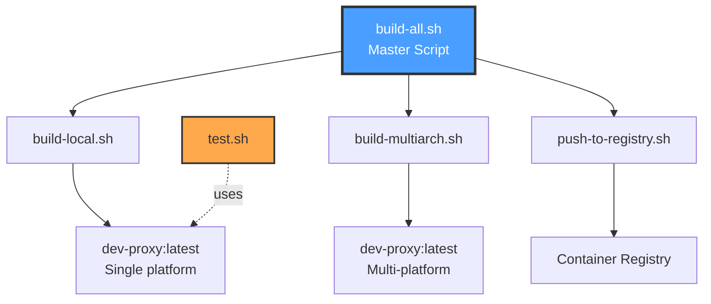

### build-local.sh

**Purpose**: Quick build for immediate local use

**Features:**
- Builds for current platform only (Mac arm64 or Linux amd64)
- Fastest build option
- No registry required
- Creates `dev-proxy:latest` tag

**Usage:**
```bash
./scripts/build-local.sh
```

**Workflow:**


### build-multiarch.sh

**Purpose**: Build for both Mac and Linux platforms

**Features:**
- Uses Docker Buildx
- Creates multi-platform manifest
- Builds arm64 + amd64 simultaneously
- Can push to registry or load locally

**Usage:**
```bash
# Build only (no push)
./scripts/build-multiarch.sh

# Build and push to registry
export DO_REGISTRY=registry.digitalocean.com/your-registry
./scripts/build-multiarch.sh
```

**Workflow:**

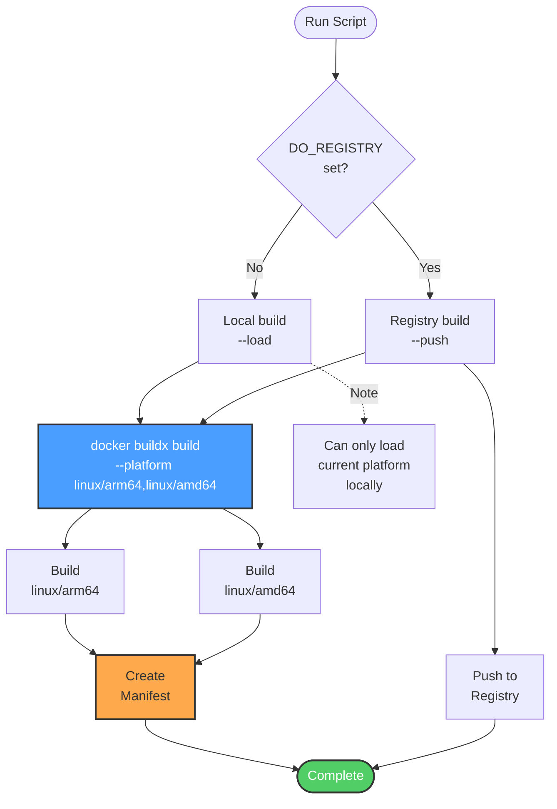

### push-to-registry.sh

**Purpose**: Authenticate and push to container registry

**Features:**
- Authenticates with registry
- Pushes multi-arch manifest
- Supports any Docker-compatible registry
- Validates image exists before pushing

**Required Variables:**
- `DO_REGISTRY`: Registry URL
- `DO_TOKEN`: Registry authentication token
- `TAG`: Image tag (default: latest)

**Usage:**
```bash
export DO_REGISTRY=registry.digitalocean.com/your-registry
export DO_TOKEN=dop_v1_abc123...
export TAG=latest

./scripts/push-to-registry.sh
```

**Workflow:**

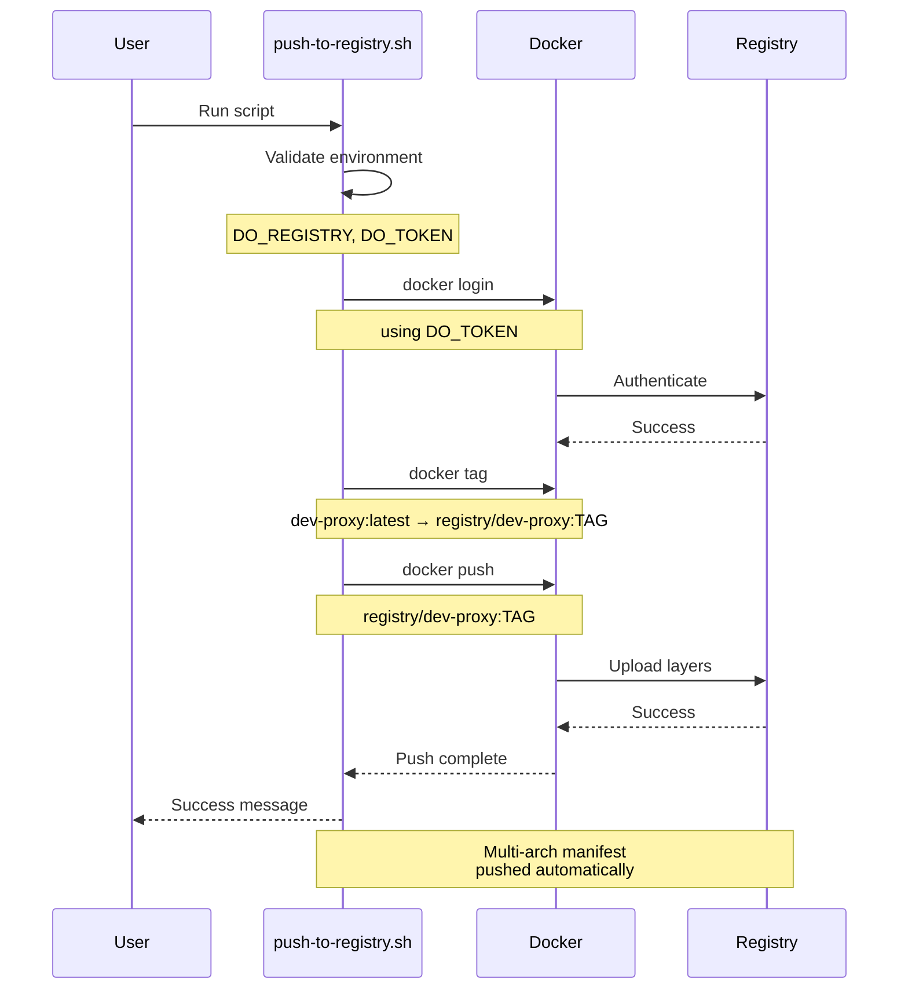

### build-all.sh

**Purpose**: Complete build and deploy pipeline

**Features:**
- Runs all build steps in sequence
- Supports `--local-only` flag
- Comprehensive error handling
- Progress reporting

**Usage:**
```bash
# Local builds only
./scripts/build-all.sh --local-only

# Build and push to registry
export DO_REGISTRY=registry.digitalocean.com/your-registry
export DO_TOKEN=dop_v1_abc123...
./scripts/build-all.sh
```

**Complete Workflow:**

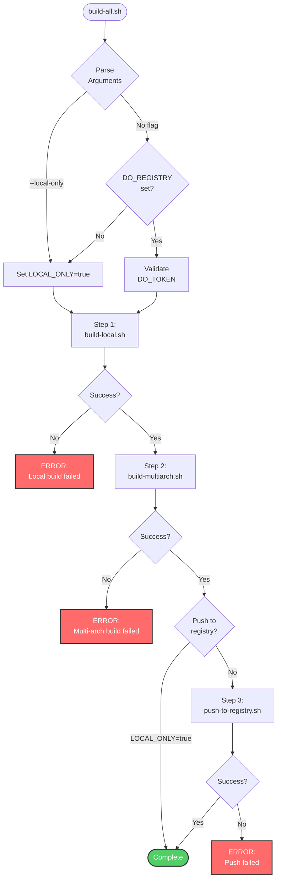

### test.sh

**Purpose**: Comprehensive integration testing

**Features:**
- Creates mock backend/frontend services
- Tests all routing patterns
- Validates security headers
- Automatic cleanup
- No external dependencies

**Usage:**
```bash
./scripts/test.sh
```

**Test Workflow:**

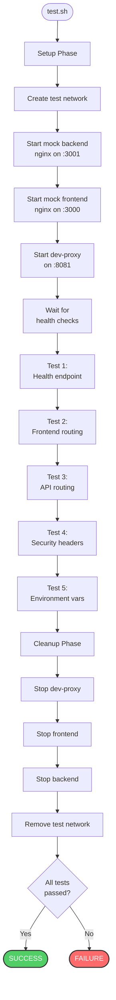

## Local Build Workflow

### Development Cycle

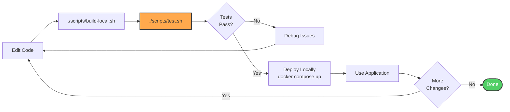

### Quick Iteration

For rapid development, use volume mounts:

```yaml
# docker-compose.override.yml
services:
  dev-proxy:
    volumes:
      - ./nginx.conf.template:/etc/nginx/templates/default.conf.template
```

```bash
# After editing nginx.conf.template:
docker compose exec dev-proxy nginx -s reload
# No rebuild needed!
```

## Multi-Architecture Build

### Platform Support

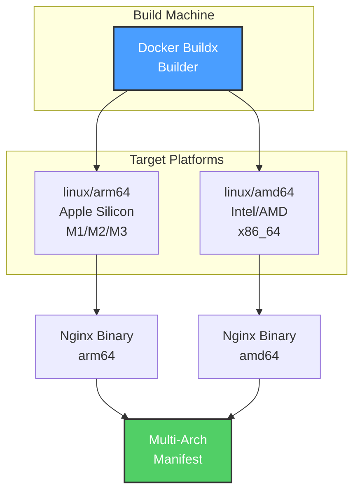

### Buildx Setup

```bash
# Create buildx builder (one-time setup)
docker buildx create --name multiarch-builder --use
docker buildx inspect --bootstrap

# Verify platforms
docker buildx ls
```

### Build Process Details

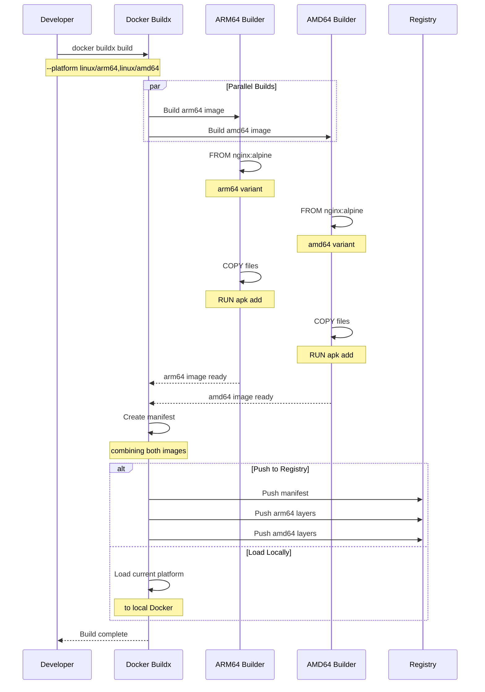

## Registry Push Workflow

### Supported Registries

Dev Proxy can push to any Docker-compatible registry:

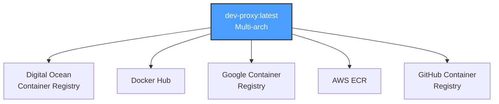

### Push Process

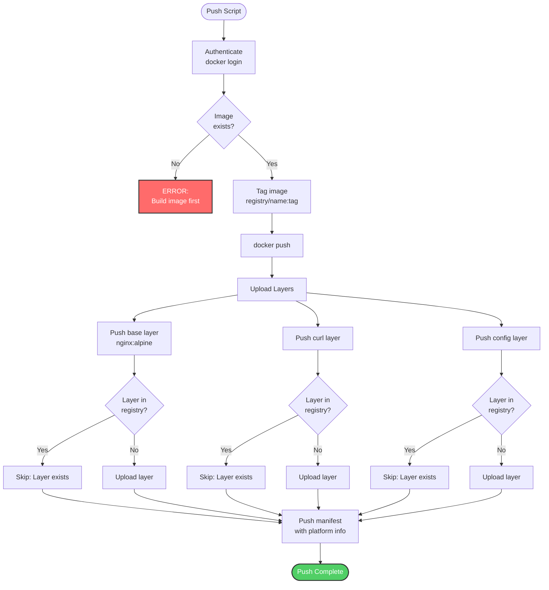

### Registry Configuration Examples

#### Digital Ocean

```bash
export DO_REGISTRY=registry.digitalocean.com/your-registry
export DO_TOKEN=dop_v1_your_token_here
export TAG=latest

./scripts/push-to-registry.sh
```

#### Docker Hub

```bash
export DO_REGISTRY=docker.io/yourusername
export DO_TOKEN=your_docker_hub_token
export TAG=v1.0.0

./scripts/push-to-registry.sh
```

#### GitHub Container Registry

```bash
export DO_REGISTRY=ghcr.io/yourusername
export DO_TOKEN=ghp_your_github_token
export TAG=latest

./scripts/push-to-registry.sh
```

## Testing Workflow

### Test Architecture

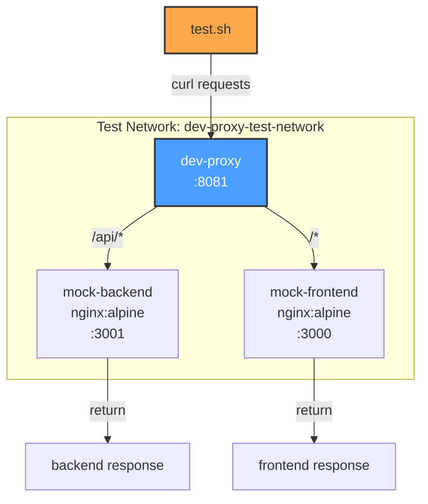

### Test Sequence

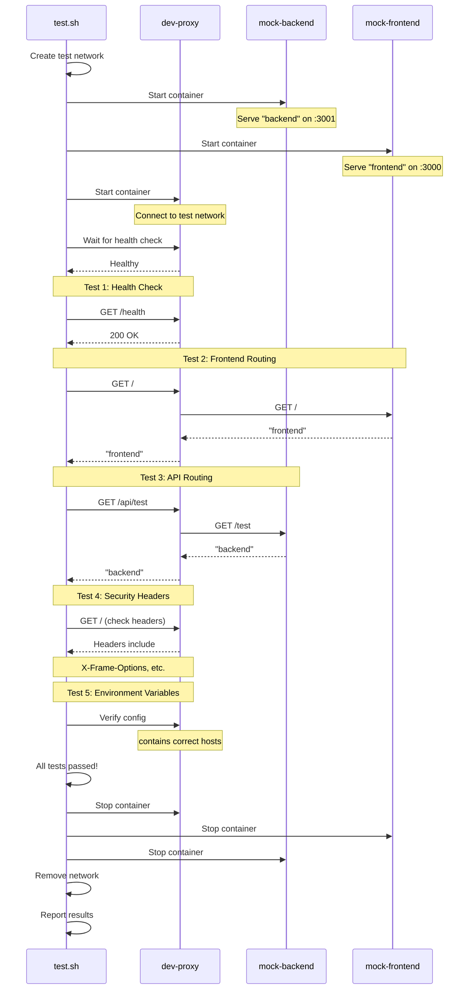

### Test Validation

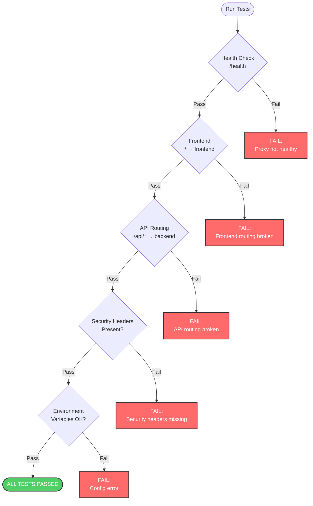

## Complete Build Pipeline

### Full Development to Production Flow

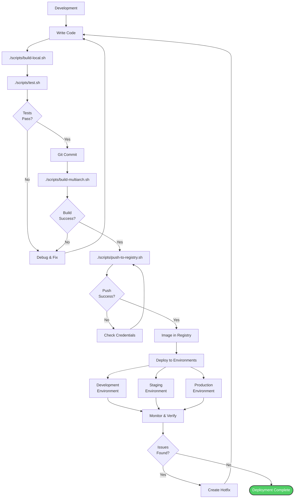

### Automated Pipeline (CI/CD)

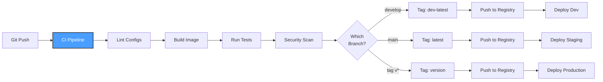

## Best Practices

### 1. Development

- Use `build-local.sh` for quick iterations
- Run `test.sh` before committing
- Use volume mounts for config changes

### 2. Testing

- Always test locally before pushing
- Validate on both Mac and Linux if possible
- Check security headers in tests

### 3. Registry

- Use semantic versioning for tags
- Keep `latest` tag for current stable
- Tag commits with version numbers

### 4. Security

- Scan images before deploying: `docker scan dev-proxy:latest`
- Keep base image updated
- Review nginx security advisories

## Related Documentation

- [Architecture](Architecture) - Understanding what's being built
- [Configuration](Configuration) - Build-time configuration
- [Security](Security) - Security considerations in builds
- [Troubleshooting](Troubleshooting) - Build issues and solutions
