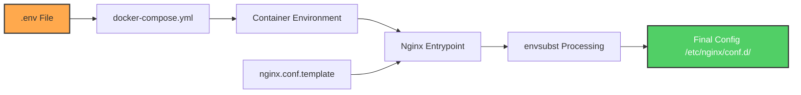
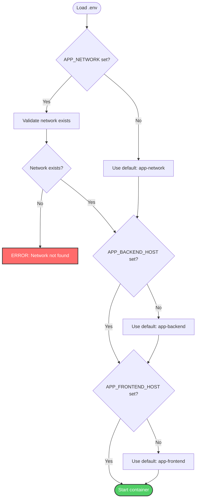
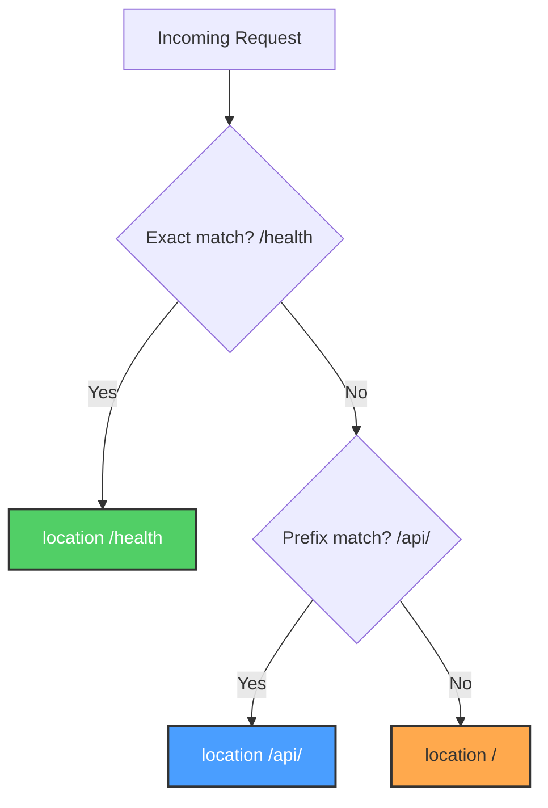
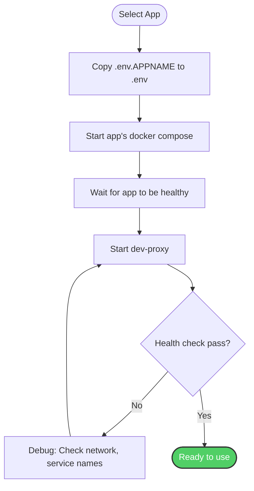

# Configuration

This page provides detailed configuration information for Dev Proxy, including all environment variables, nginx settings, and configuration patterns.

## Table of Contents

- [Environment Variables](#environment-variables)
- [Configuration Files](#configuration-files)
- [Nginx Configuration](#nginx-configuration)
- [Docker Compose Configuration](#docker-compose-configuration)
- [Multi-App Configurations](#multi-app-configurations)
- [Advanced Configuration](#advanced-configuration)

## Environment Variables

### Overview

Dev Proxy is configured entirely through environment variables, allowing the same Docker image to work with any application.



### Required Variables

| Variable | Default | Description | Example |
|----------|---------|-------------|---------|
| `APP_NETWORK` | `app-network` | Docker network name | `crudibase-network` |
| `APP_BACKEND_HOST` | `app-backend` | Backend container name | `crudibase-backend` |
| `APP_FRONTEND_HOST` | `app-frontend` | Frontend container name | `crudibase-frontend` |

### Optional Variables

| Variable | Default | Description | Example |
|----------|---------|-------------|---------|
| `PROXY_PORT` | `8080` | External port on host | `8080`, `8081` |
| `APP_BACKEND_PORT` | `3001` | Backend internal port | `3001` |
| `APP_FRONTEND_PORT` | `3000` | Frontend internal port | `3000` |

### Variable Validation



## Configuration Files

### .env File

Create from template:

```bash
cp .env.example .env
```

**Example configurations:**

#### Configuration 1: crudibase

```bash
# Network configuration
APP_NETWORK=crudibase-network

# Service names
APP_BACKEND_HOST=crudibase-backend
APP_FRONTEND_HOST=crudibase-frontend

# Ports (optional, these are the defaults)
APP_BACKEND_PORT=3001
APP_FRONTEND_PORT=3000
PROXY_PORT=8080
```

#### Configuration 2: cruditrack

```bash
# Network configuration
APP_NETWORK=cruditrack-network

# Service names
APP_BACKEND_HOST=cruditrack-backend
APP_FRONTEND_HOST=cruditrack-frontend

# Ports
APP_BACKEND_PORT=3001
APP_FRONTEND_PORT=3000
PROXY_PORT=8080
```

#### Configuration 3: Custom Ports

```bash
# Network configuration
APP_NETWORK=my-app-network

# Service names
APP_BACKEND_HOST=my-backend
APP_FRONTEND_HOST=my-frontend

# Custom ports
APP_BACKEND_PORT=4000
APP_FRONTEND_PORT=5000
PROXY_PORT=8081
```

### .env.example

Template file provided in repository:

```bash
# Docker network name (your app's docker compose network)
APP_NETWORK=app-network

# Backend service configuration
APP_BACKEND_HOST=app-backend
APP_BACKEND_PORT=3001

# Frontend service configuration
APP_FRONTEND_HOST=app-frontend
APP_FRONTEND_PORT=3000

# External proxy port on host machine
PROXY_PORT=8080
```

### .gitignore

**Important**: `.env` files should never be committed to version control.

```gitignore
.env
```

## Nginx Configuration

### Template File

Location: `nginx.conf.template`

This file is processed at container startup using `envsubst`.

#### Full Configuration

```nginx
# Proxy timeouts
proxy_connect_timeout 60s;
proxy_send_timeout 60s;
proxy_read_timeout 60s;

# Client settings
client_max_body_size 20M;

server {
    listen 8080;
    server_name localhost;

    # Security headers
    add_header X-Frame-Options "SAMEORIGIN" always;
    add_header X-Content-Type-Options "nosniff" always;
    add_header X-XSS-Protection "1; mode=block" always;
    add_header Referrer-Policy "strict-origin-when-cross-origin" always;

    # Health check endpoint
    location /health {
        access_log off;
        return 200 "OK\n";
        add_header Content-Type text/plain;
    }

    # Proxy API requests to backend
    location /api/ {
        proxy_pass http://${APP_BACKEND_HOST}:${APP_BACKEND_PORT}/;
        proxy_http_version 1.1;
        proxy_set_header Upgrade $http_upgrade;
        proxy_set_header Connection 'upgrade';
        proxy_set_header Host $host;
        proxy_set_header X-Real-IP $remote_addr;
        proxy_set_header X-Forwarded-For $proxy_add_x_forwarded_for;
        proxy_set_header X-Forwarded-Proto $scheme;
        proxy_cache_bypass $http_upgrade;
    }

    # Proxy frontend requests
    location / {
        proxy_pass http://${APP_FRONTEND_HOST}:${APP_FRONTEND_PORT};
        proxy_http_version 1.1;
        proxy_set_header Upgrade $http_upgrade;
        proxy_set_header Connection 'upgrade';
        proxy_set_header Host $host;
        proxy_set_header X-Real-IP $remote_addr;
        proxy_set_header X-Forwarded-For $proxy_add_x_forwarded_for;
        proxy_set_header X-Forwarded-Proto $scheme;
        proxy_cache_bypass $http_upgrade;
    }
}
```

#### Configuration Sections

##### 1. Timeout Configuration

```nginx
proxy_connect_timeout 60s;  # Time to connect to upstream
proxy_send_timeout 60s;     # Time to send to upstream
proxy_read_timeout 60s;     # Time to read from upstream
```

**When to adjust:**

- Long-running API requests: Increase `proxy_read_timeout`
- Slow backend startup: Increase `proxy_connect_timeout`
- Large uploads: Increase `proxy_send_timeout`

##### 2. Client Settings

```nginx
client_max_body_size 20M;
```

Controls maximum upload size. Increase for file uploads:

```nginx
client_max_body_size 100M;  # Allow 100MB uploads
```

##### 3. Security Headers

```nginx
add_header X-Frame-Options "SAMEORIGIN" always;
add_header X-Content-Type-Options "nosniff" always;
add_header X-XSS-Protection "1; mode=block" always;
add_header Referrer-Policy "strict-origin-when-cross-origin" always;
```

See [Security](Security) for details on each header.

##### 4. Location Blocks

**Order matters!** Nginx evaluates in this order:

1. Exact match: `location = /health`
2. Prefix match: `location /api/`
3. Default match: `location /`



### Variable Substitution

At startup, nginx's entrypoint runs `envsubst` on template files:

```bash
# This happens automatically in the nginx:alpine image
envsubst '${APP_BACKEND_HOST} ${APP_BACKEND_PORT} ${APP_FRONTEND_HOST} ${APP_FRONTEND_PORT}' \
  < /etc/nginx/templates/default.conf.template \
  > /etc/nginx/conf.d/default.conf
```

**Before substitution:**
```nginx
proxy_pass http://${APP_BACKEND_HOST}:${APP_BACKEND_PORT}/;
```

**After substitution:**
```nginx
proxy_pass http://crudibase-backend:3001/;
```

## Docker Compose Configuration

### Complete docker-compose.yml

```yaml
version: '3.8'

services:
  dev-proxy:
    build:
      context: .
      dockerfile: Dockerfile
    image: dev-proxy:latest
    container_name: dev-proxy
    restart: unless-stopped
    ports:
      - "${PROXY_PORT:-8080}:8080"
    environment:
      - APP_BACKEND_HOST=${APP_BACKEND_HOST:-app-backend}
      - APP_BACKEND_PORT=${APP_BACKEND_PORT:-3001}
      - APP_FRONTEND_HOST=${APP_FRONTEND_HOST:-app-frontend}
      - APP_FRONTEND_PORT=${APP_FRONTEND_PORT:-3000}
    networks:
      - ${APP_NETWORK:-app-network}
    healthcheck:
      test: ["CMD", "curl", "-f", "http://localhost:8080/health"]
      interval: 30s
      timeout: 3s
      retries: 3
      start_period: 10s

networks:
  app-network:
    external: true
    name: ${APP_NETWORK:-app-network}
```

### Configuration Breakdown

#### Service Definition

```yaml
dev-proxy:
  build:
    context: .           # Build from current directory
    dockerfile: Dockerfile
  image: dev-proxy:latest
  container_name: dev-proxy
  restart: unless-stopped
```

#### Port Mapping

```yaml
ports:
  - "${PROXY_PORT:-8080}:8080"
```

**Format**: `HOST_PORT:CONTAINER_PORT`

- `${PROXY_PORT:-8080}` - Use env var, default to 8080
- `:8080` - Container always listens on 8080

#### Environment Variables

```yaml
environment:
  - APP_BACKEND_HOST=${APP_BACKEND_HOST:-app-backend}
  - APP_BACKEND_PORT=${APP_BACKEND_PORT:-3001}
  - APP_FRONTEND_HOST=${APP_FRONTEND_HOST:-app-frontend}
  - APP_FRONTEND_PORT=${APP_FRONTEND_PORT:-3000}
```

**Syntax**: `${VAR_NAME:-default_value}`

#### Network Configuration

```yaml
networks:
  - ${APP_NETWORK:-app-network}

networks:
  app-network:
    external: true
    name: ${APP_NETWORK:-app-network}
```

**Key points:**

- `external: true` - Network must exist before starting
- Network created by your app's `docker compose`
- Dev proxy joins existing network

#### Health Check

```yaml
healthcheck:
  test: ["CMD", "curl", "-f", "http://localhost:8080/health"]
  interval: 30s
  timeout: 3s
  retries: 3
  start_period: 10s
```

**Parameters:**

- `interval`: Time between checks
- `timeout`: Max time for check to complete
- `retries`: Failures before marking unhealthy
- `start_period`: Grace period on startup

## Multi-App Configurations

### Switching Between Apps

Create multiple `.env` files:

```bash
# .env.crudibase
APP_NETWORK=crudibase-network
APP_BACKEND_HOST=crudibase-backend
APP_FRONTEND_HOST=crudibase-frontend

# .env.cruditrack
APP_NETWORK=cruditrack-network
APP_BACKEND_HOST=cruditrack-backend
APP_FRONTEND_HOST=cruditrack-frontend
```

**Switch apps:**

```bash
# Switch to crudibase
cp .env.crudibase .env
docker compose restart

# Switch to cruditrack
cp .env.cruditrack .env
docker compose restart
```

### Configuration Workflow



## Advanced Configuration

### Custom Nginx Directives

To add custom nginx configuration, you need to modify `nginx.conf.template`.

#### Example: Add CORS Headers

```nginx
location /api/ {
    # Existing config...
    proxy_pass http://${APP_BACKEND_HOST}:${APP_BACKEND_PORT}/;

    # Add CORS headers
    add_header 'Access-Control-Allow-Origin' '*' always;
    add_header 'Access-Control-Allow-Methods' 'GET, POST, PUT, DELETE, OPTIONS' always;
    add_header 'Access-Control-Allow-Headers' 'Authorization, Content-Type' always;

    # Handle preflight
    if ($request_method = 'OPTIONS') {
        return 204;
    }
}
```

#### Example: Increase Timeouts

```nginx
# At the top of the file
proxy_connect_timeout 120s;
proxy_send_timeout 120s;
proxy_read_timeout 120s;
```

#### Example: Add Request Logging

```nginx
# Inside server block
access_log /var/log/nginx/access.log;
error_log /var/log/nginx/error.log;

# Disable health check logging
location /health {
    access_log off;
    return 200 "OK\n";
}
```

### Environment-Specific Configs

Use Docker Compose override files:

#### docker-compose.override.yml (development)

```yaml
version: '3.8'

services:
  dev-proxy:
    environment:
      - DEBUG=true
    volumes:
      - ./nginx.conf.template:/etc/nginx/templates/default.conf.template
```

This allows live editing of nginx config without rebuilding.

### Resource Limits

Add resource constraints:

```yaml
services:
  dev-proxy:
    deploy:
      resources:
        limits:
          cpus: '0.5'
          memory: 256M
        reservations:
          cpus: '0.25'
          memory: 128M
```

### Logging Configuration

```yaml
services:
  dev-proxy:
    logging:
      driver: "json-file"
      options:
        max-size: "10m"
        max-file: "3"
```

## Configuration Validation

### Validate Environment Variables

```bash
# Check if required vars are set
docker compose config

# This will show the resolved configuration
# with all variable substitutions
```

### Validate Nginx Config

```bash
# Test nginx config syntax
docker compose exec dev-proxy nginx -t

# Expected output:
# nginx: the configuration file /etc/nginx/nginx.conf syntax is ok
# nginx: configuration file /etc/nginx/nginx.conf test is successful
```

### Validate Network Connectivity

```bash
# Check if backend is reachable
docker compose exec dev-proxy curl -f http://${APP_BACKEND_HOST}:${APP_BACKEND_PORT}/health

# Check if frontend is reachable
docker compose exec dev-proxy curl -f http://${APP_FRONTEND_HOST}:${APP_FRONTEND_PORT}/
```

## Related Documentation

- [Architecture](Architecture) - How configuration flows through the system
- [Request Flow](Request-Flow) - How nginx uses the configuration
- [Build Process](Build-Process) - Building with different configurations
- [Troubleshooting](Troubleshooting) - Configuration-related issues
