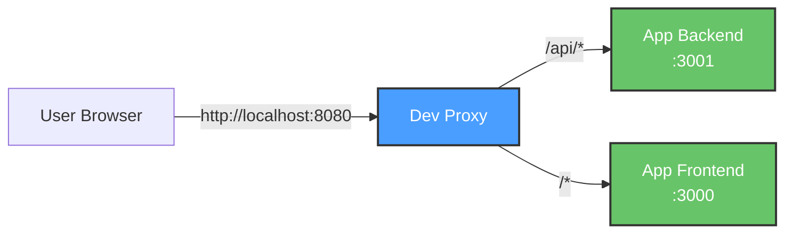

# Dev Proxy Wiki

Welcome to the **Dev Proxy** documentation! This wiki provides comprehensive information about the nginx-based development proxy for testing containerized applications locally.

## What is Dev Proxy?

Dev Proxy is a simple, lightweight HTTP proxy built on nginx that allows you to access your application's frontend and backend services through a single localhost port during local development. It's designed specifically for development and testing environments and should **never** be used in production.

## Key Features

- **No SSL** - Simple HTTP proxy for local development
- **Multi-arch** - Builds for both Mac (arm64) and Linux (amd64)
- **Configurable** - Point to any app's docker network and services
- **Lightweight** - Based on nginx:alpine
- **Health checks** - Built-in health monitoring
- **Security headers** - Basic security headers even for dev environments

## Quick Start

```bash
# 1. Configure your app
cp .env.example .env
# Edit .env with your app's network and service names

# 2. Start your app
cd /path/to/your/app && docker compose up -d

# 3. Start dev proxy
docker compose up -d

# 4. Access at http://localhost:8080
```

## Documentation

### Core Documentation

- **[Architecture](Architecture.md)** - System architecture, components, and design decisions
- **[Request Flow](Request-Flow.md)** - How requests flow through the proxy with sequence diagrams
- **[Configuration](Configuration.md)** - Detailed configuration reference and examples

### Operations

- **[Build Process](Build-Process.md)** - Building, testing, and pushing to registries
- **[Security](Security.md)** - Security considerations and best practices
- **[Troubleshooting](Troubleshooting.md)** - Common issues and solutions

## Architecture Overview



## Common Use Cases

1. **Local Development** - Test your full-stack app through a single endpoint
2. **Multi-App Testing** - Quickly switch between different apps by changing `.env`
3. **Integration Testing** - Test frontend-backend integration without complex routing
4. **Container Networking** - Debug Docker network connectivity issues

## Getting Help

- Check the **[Troubleshooting](Troubleshooting.md)** guide
- Review existing [GitHub Issues](https://github.com/softwarewrighter/dev-proxy/issues)
- Read the main [README](../README.md) and [QUICK_START](../QUICK_START.md) guides

## Contributing

This is an open-source project. Contributions are welcome! Please ensure:

1. All tests pass: `./scripts/test.sh`
2. Documentation is updated
3. Security best practices are followed

## Version

Current version: **0.1.x**

See [CHANGELOG.md](../CHANGELOG.md) for version history.
