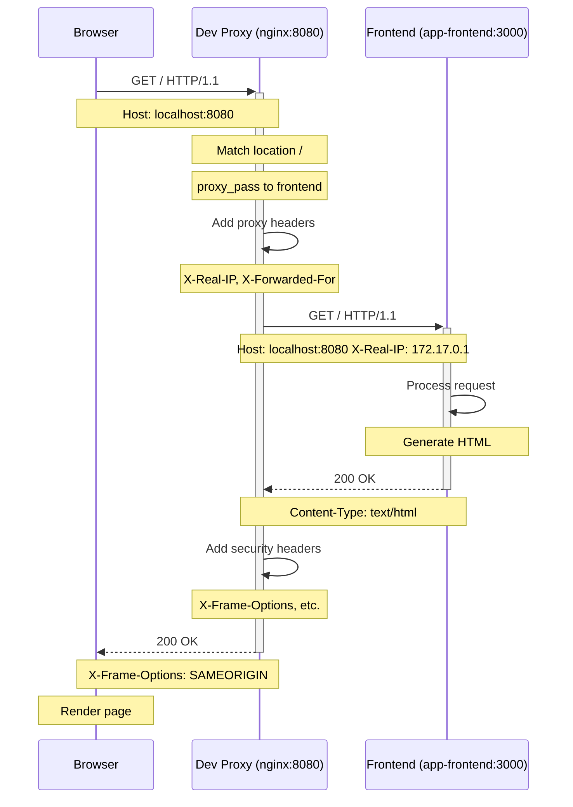
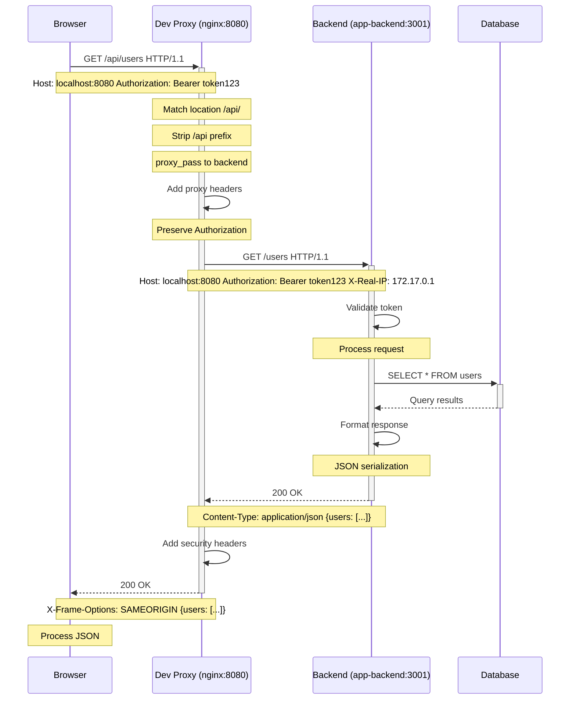
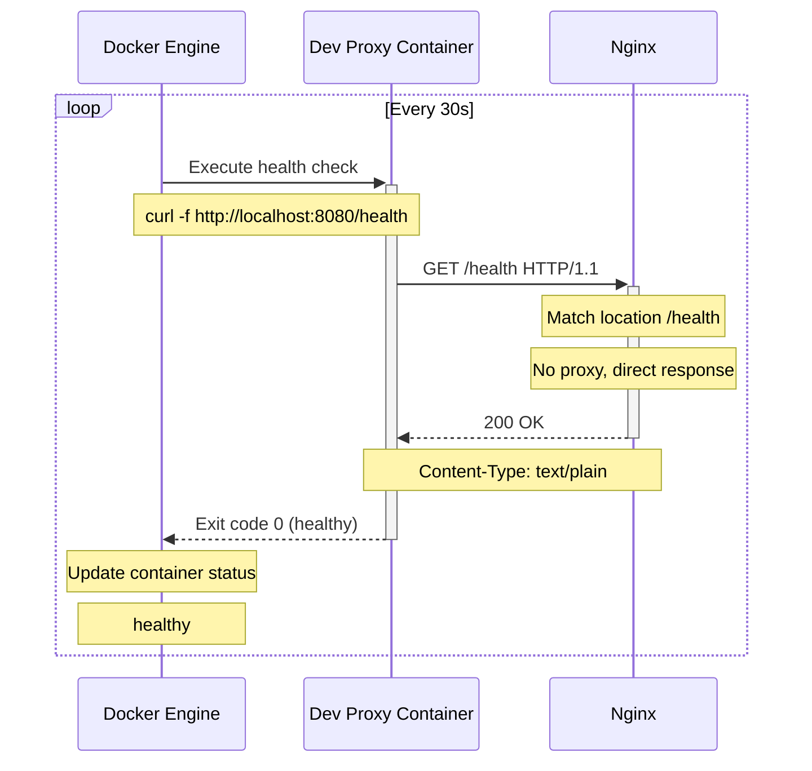
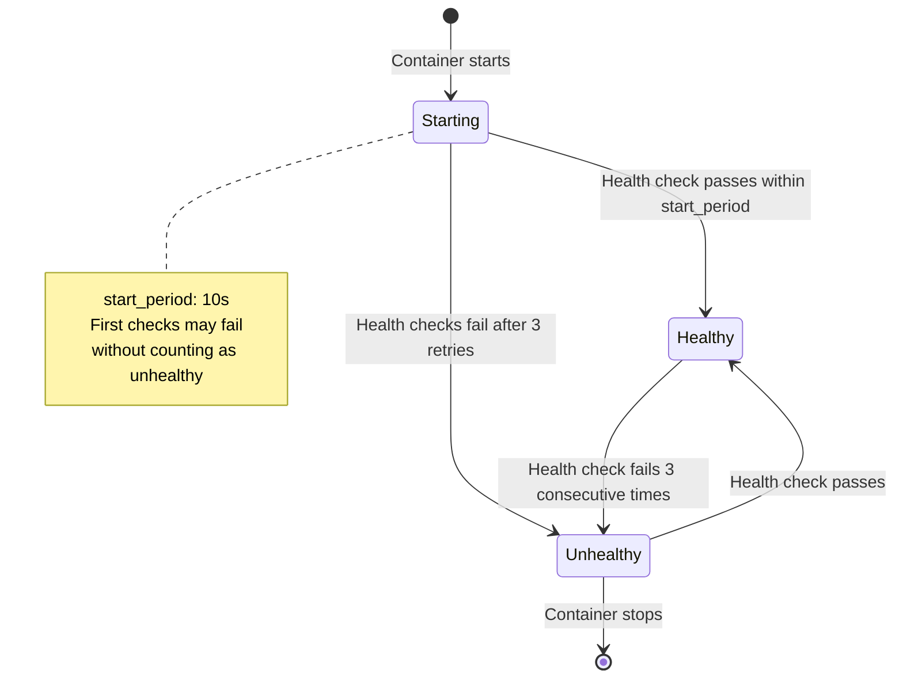
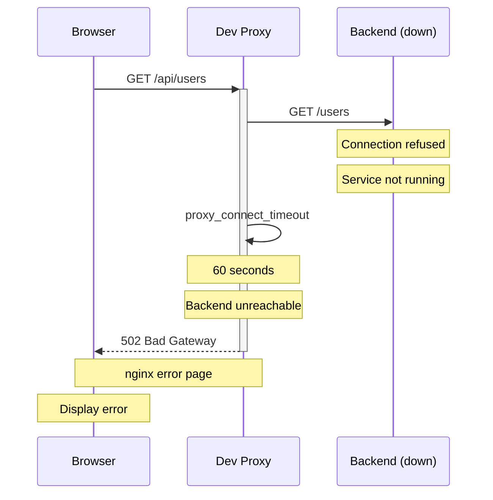
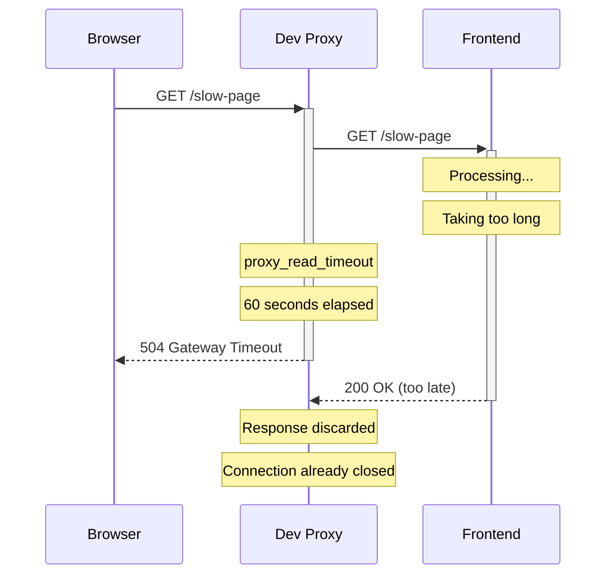
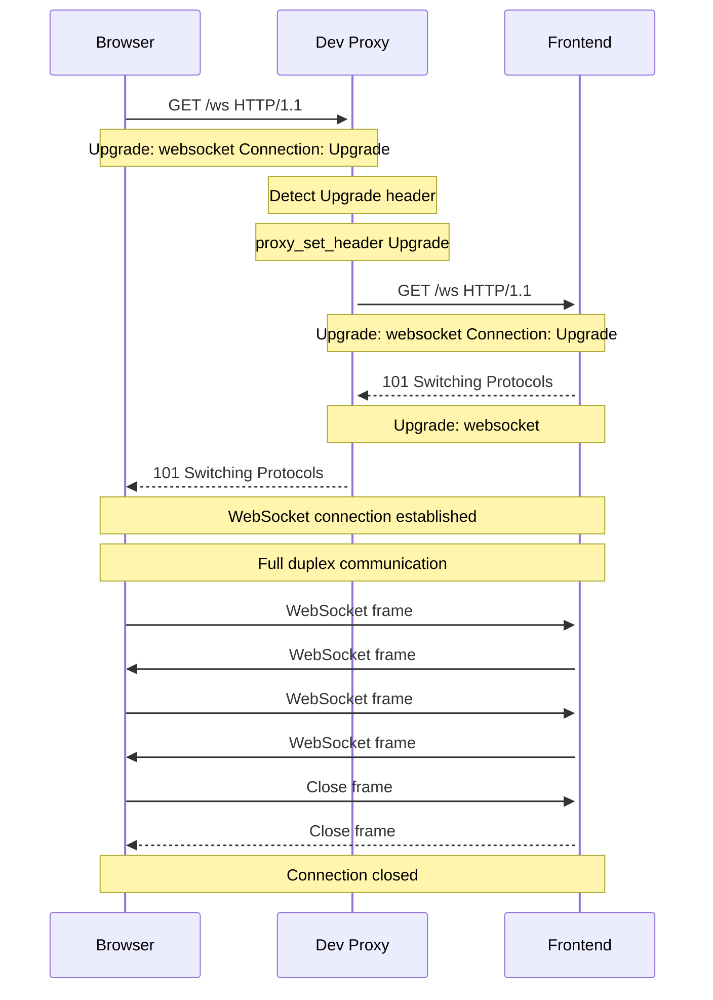
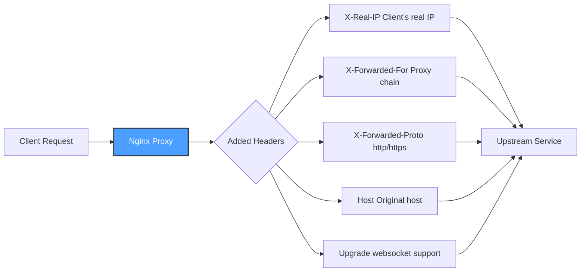
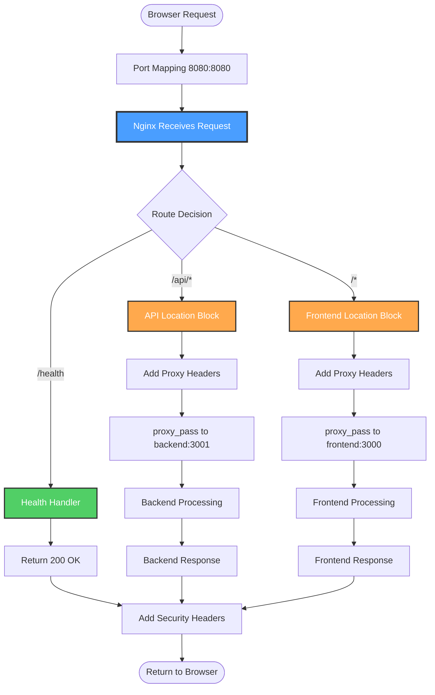

# Request Flow

This page details how HTTP requests flow through the Dev Proxy system, including sequence diagrams for different request types.

## Table of Contents

- [Overview](#overview)
- [Frontend Request Flow](#frontend-request-flow)
- [API Request Flow](#api-request-flow)
- [Health Check Flow](#health-check-flow)
- [Error Scenarios](#error-scenarios)
- [WebSocket Support](#websocket-support)
- [Request Headers](#request-headers)

## Overview

Dev Proxy handles three main types of requests:

1. **Health Checks** (`/health`) - Direct response from nginx
2. **API Requests** (`/api/*`) - Proxied to backend with path rewrite
3. **Frontend Requests** (`/*`) - Proxied to frontend

All requests flow through nginx's routing logic based on URL path matching.

## Frontend Request Flow

### Sequence Diagram



### Step-by-Step Flow

1. **Browser Request**: User navigates to `http://localhost:8080/`
2. **Port Mapping**: Request hits Docker port mapping (8080 → container:8080)
3. **Nginx Routing**: nginx matches `location /` block
4. **Proxy Pass**: Request forwarded to `http://app-frontend:3000/`
5. **Header Addition**: Proxy headers added (X-Real-IP, X-Forwarded-For, etc.)
6. **Frontend Processing**: Frontend app processes request
7. **Response Headers**: Security headers added by nginx
8. **Return to Browser**: Response sent back through proxy

## API Request Flow

### Sequence Diagram



### Path Rewriting

**Important**: The `/api` prefix is **stripped** before proxying to backend.

```
Incoming:  http://localhost:8080/api/users
Proxied:   http://app-backend:3001/users
```

This is configured in nginx:

```nginx
location /api/ {
    proxy_pass http://${APP_BACKEND_HOST}:${APP_BACKEND_PORT}/;
    # Note the trailing slash ──────────────────────────────^
}
```

### Request Examples

| Browser URL | Proxied to Backend |
|-------------|-------------------|
| `/api/users` | `/users` |
| `/api/users/123` | `/users/123` |
| `/api/v1/posts` | `/v1/posts` |
| `/api/health` | `/health` |

## Health Check Flow

### Docker Health Check Sequence



### Health Check Configuration

**Docker Compose:**
```yaml
healthcheck:
  test: ["CMD", "curl", "-f", "http://localhost:8080/health"]
  interval: 30s
  timeout: 3s
  retries: 3
  start_period: 10s
```

**Nginx Config:**
```nginx
location /health {
    access_log off;
    return 200 "OK\n";
    add_header Content-Type text/plain;
}
```

### Health Check States



## Error Scenarios

### Backend Unavailable



### Frontend Timeout



### Timeout Configuration

```nginx
proxy_connect_timeout 60s;  # Time to establish connection
proxy_send_timeout 60s;     # Time to send request to backend
proxy_read_timeout 60s;     # Time to read response from backend
```

## WebSocket Support

Dev Proxy supports WebSocket connections through the Upgrade header.

### WebSocket Flow



### WebSocket Configuration

```nginx
location / {
    proxy_pass http://${APP_FRONTEND_HOST}:${APP_FRONTEND_PORT};
    proxy_http_version 1.1;
    proxy_set_header Upgrade $http_upgrade;
    proxy_set_header Connection 'upgrade';
    proxy_cache_bypass $http_upgrade;
}
```

**Key Headers:**

- `Upgrade: $http_upgrade` - Forwards upgrade header
- `Connection: 'upgrade'` - Maintains connection for upgrade
- `proxy_http_version 1.1` - Required for WebSocket (HTTP/1.0 doesn't support it)

### Use Cases

- **Hot Module Replacement (HMR)** - Development servers like Vite, webpack-dev-server
- **Live Reload** - Development tools
- **Real-time Features** - Chat, notifications, live updates

## Request Headers

### Headers Added by Dev Proxy



### Request Header Flow

**Original Request:**
```http
GET /api/users HTTP/1.1
Host: localhost:8080
User-Agent: Mozilla/5.0
```

**Proxied Request:**
```http
GET /users HTTP/1.1
Host: localhost:8080
User-Agent: Mozilla/5.0
X-Real-IP: 172.17.0.1
X-Forwarded-For: 172.17.0.1
X-Forwarded-Proto: http
Connection: upgrade
```

### Response Headers Added

```nginx
add_header X-Frame-Options "SAMEORIGIN" always;
add_header X-Content-Type-Options "nosniff" always;
add_header X-XSS-Protection "1; mode=block" always;
add_header Referrer-Policy "strict-origin-when-cross-origin" always;
```

**Purpose:**

- **X-Frame-Options**: Prevent clickjacking
- **X-Content-Type-Options**: Prevent MIME sniffing
- **X-XSS-Protection**: Enable browser XSS filter
- **Referrer-Policy**: Control referrer information

## Complete Request Flow Diagram



## Performance Characteristics

### Latency

- **Health Check**: < 1ms (local response)
- **Proxy Overhead**: ~1-5ms (header processing)
- **Total Latency**: Proxy overhead + upstream processing time

### Throughput

Nginx can handle:
- **Concurrent Connections**: 10,000+
- **Requests/Second**: Limited by upstream services, not proxy

For development purposes, performance is excellent.

## Related Documentation

- [Architecture](Architecture) - Overall system architecture
- [Configuration](Configuration) - Configuring timeouts and limits
- [Troubleshooting](Troubleshooting) - Debugging request flow issues
