# Security

This page documents security considerations, best practices, and the security architecture of Dev Proxy.

## Table of Contents

- [Security Overview](#security-overview)
- [Threat Model](#threat-model)
- [Security Features](#security-features)
- [Container Security](#container-security)
- [Network Security](#network-security)
- [Security Headers](#security-headers)
- [Best Practices](#best-practices)
- [Security Checklist](#security-checklist)

## Security Overview

### Important Notice

**Dev Proxy is designed EXCLUSIVELY for local development and testing. It should NEVER be used in production or exposed to the public internet.**

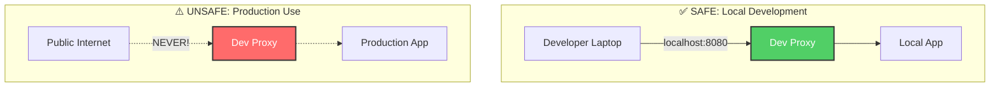

### Why Not Production?

| Feature | Dev Proxy | Production Proxy |
|---------|-----------|------------------|
| SSL/TLS | ❌ HTTP Only | ✅ HTTPS Required |
| Authentication | ❌ None | ✅ Required |
| Rate Limiting | ❌ Basic | ✅ Advanced |
| WAF | ❌ None | ✅ Required |
| DDoS Protection | ❌ None | ✅ Required |
| Logging | ⚠️ Minimal | ✅ Comprehensive |
| Monitoring | ⚠️ Basic | ✅ Advanced |

## Threat Model

### In Scope

Security issues we protect against even in development:

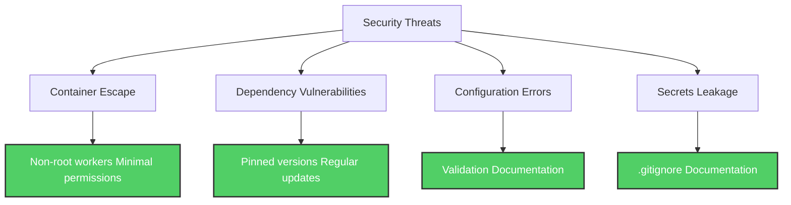

### Out of Scope

These are NOT threats for a local development tool:

- **Network attacks** (DDoS, etc.) - localhost only
- **SSL/TLS vulnerabilities** - HTTP by design
- **Authentication bypass** - no auth by design
- **Data encryption in transit** - local development only

### Attack Surface

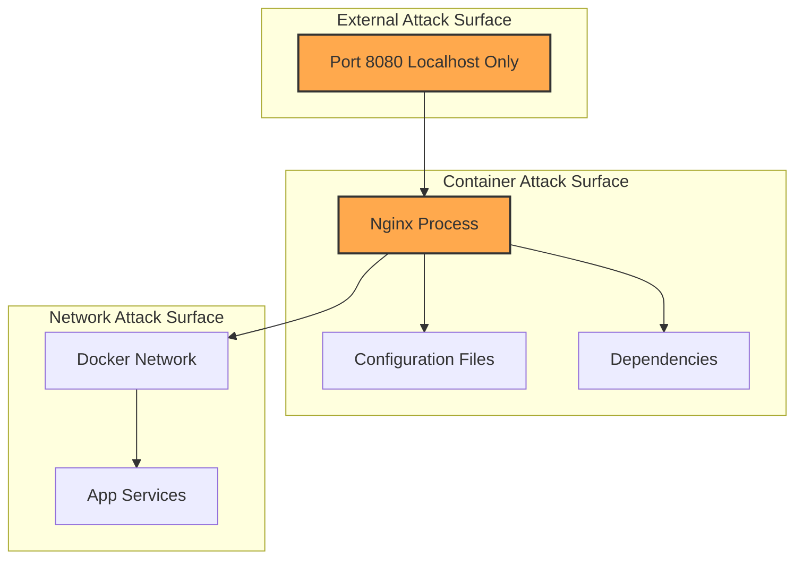

## Security Features

Despite being a development tool, Dev Proxy implements security best practices:

### Defense in Depth

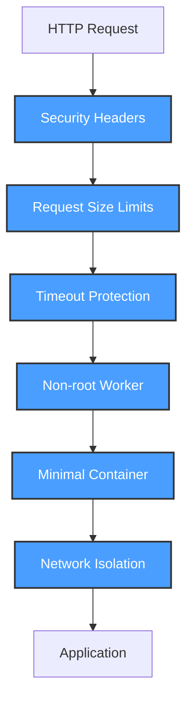

### Security Features Summary

| Feature | Implementation | Purpose |
|---------|----------------|---------|
| **Non-root execution** | nginx user | Limit container escape impact |
| **Minimal base image** | Alpine Linux | Reduce attack surface |
| **Security headers** | X-Frame-Options, etc. | Browser protection |
| **Request limits** | 20MB max body | Prevent large uploads |
| **Timeouts** | 60s default | Prevent hanging connections |
| **Health checks** | Docker healthcheck | Detect compromised containers |
| **Pinned versions** | nginx:1.25.3-alpine | Prevent supply chain attacks |

## Container Security

### Process Isolation

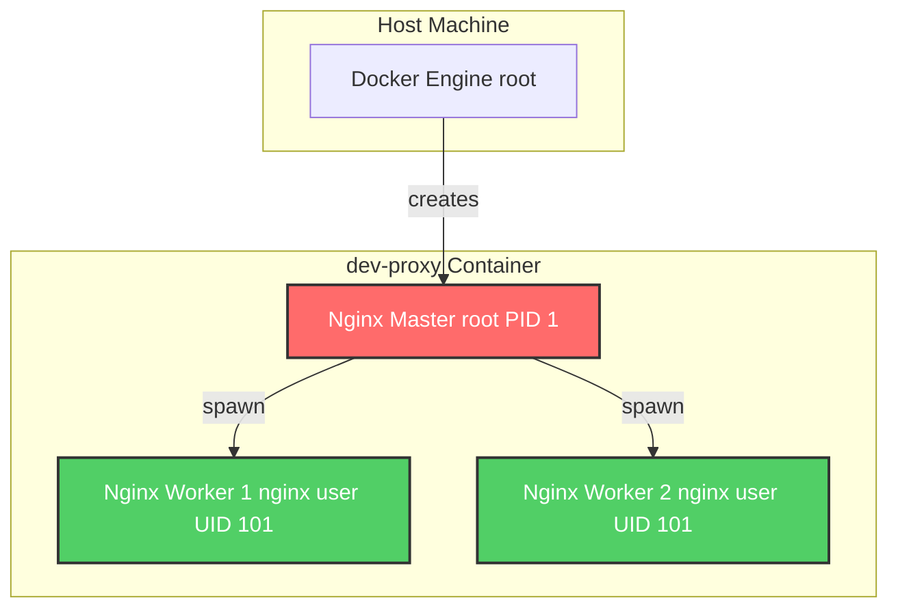

**Key Points:**

- **Master Process**: Runs as root (standard for nginx)
  - Only manages worker processes
  - Does not handle requests
  - Minimal attack surface

- **Worker Processes**: Run as `nginx` user (UID 101)
  - Handle all HTTP requests
  - Limited privileges
  - Cannot write to most directories

### File System Permissions

```mermaid
graph TB
    subgraph "Read-Only"
        Conf[/etc/nginx/ Configuration]
        Bin[/usr/sbin/nginx Binary]
    end

    subgraph "Writable (nginx user)"
        Logs[/var/log/nginx/ Logs]
        Cache[/var/cache/nginx/ Cache]
        Run[/var/run/ PID files]
    end

    Worker[Nginx Worker nginx user] --> Conf
    Worker --> Bin
    Worker --> Logs
    Worker --> Cache
    Worker --> Run

    style Conf fill:#4a9eff,stroke:#333,stroke-width:2px,color:#fff
    style Bin fill:#4a9eff,stroke:#333,stroke-width:2px,color:#fff
    style Logs fill:#ffa94d,stroke:#333,stroke-width:2px
    style Cache fill:#ffa94d,stroke:#333,stroke-width:2px
    style Run fill:#ffa94d,stroke:#333,stroke-width:2px
```

### Container Capabilities

Default Docker capabilities with no additional privileges:

```bash
# View container capabilities
docker inspect dev-proxy --format='{{.HostConfig.CapDrop}}'
docker inspect dev-proxy --format='{{.HostConfig.CapAdd}}'
```

**No privileged mode** - Container runs with minimal capabilities.

### Image Layers Security

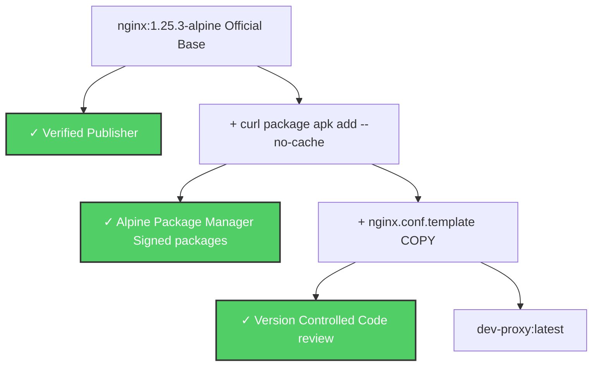

**Security Practices:**

1. **Base Image**: Official nginx image from Docker Hub
2. **Pinned Version**: `nginx:1.25.3-alpine` (not `latest`)
3. **Minimal Additions**: Only `curl` for health checks
4. **No Build Args**: No secrets in build process

## Network Security

### Network Isolation

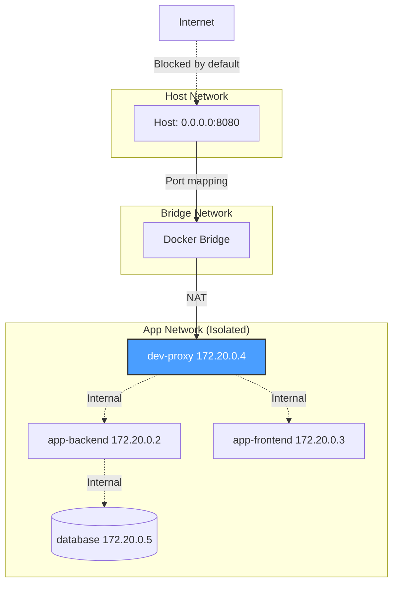

**Network Security Features:**

1. **Isolated Network**: App network separate from host
2. **Port Mapping**: Only proxy port exposed to host
3. **Internal DNS**: Services communicate via names, not IPs
4. **No Public Access**: Firewall blocks external access (default)

### Port Exposure

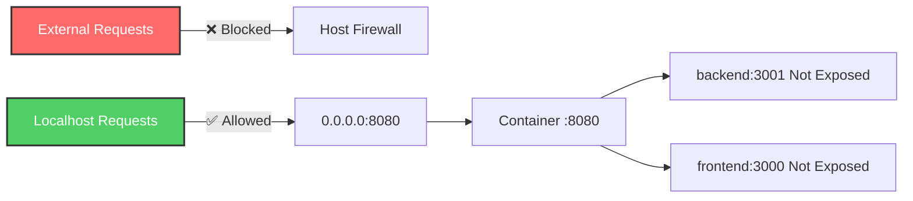

**Best Practice**: Only bind to localhost in production environments:

```yaml
ports:
  - "127.0.0.1:8080:8080"  # Localhost only
  # NOT "0.0.0.0:8080:8080"  # All interfaces
```

## Security Headers

### Implemented Headers

Dev Proxy adds security headers to all responses:

```nginx
add_header X-Frame-Options "SAMEORIGIN" always;
add_header X-Content-Type-Options "nosniff" always;
add_header X-XSS-Protection "1; mode=block" always;
add_header Referrer-Policy "strict-origin-when-cross-origin" always;
```

### Header Flow

```mermaid
sequenceDiagram
    participant Browser
    participant Proxy as Dev Proxy
    participant App as Application

    Browser->>Proxy: GET /page

    Proxy->>App: GET /page
    App-->>Proxy: 200 OK
    Note over App,Proxy: Content-Type: text/html

    Note over Proxy: Add security headers

    Proxy-->>Browser: 200 OK
    Note over Proxy,Browser: X-Frame-Options: SAMEORIGIN X-Content-Type-Options: nosniff X-XSS-Protection: 1; mode=block Referrer-Policy: strict-origin-when-cross-origin

    Note over Browser: Apply security policies
```

### Header Explanations

#### X-Frame-Options: SAMEORIGIN

**Purpose**: Prevent clickjacking attacks

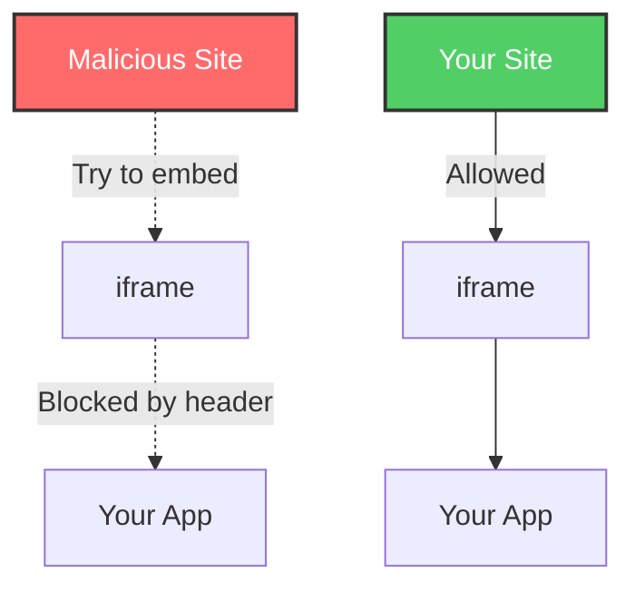

**Effect**: Your app can only be embedded in frames from the same origin.

#### X-Content-Type-Options: nosniff

**Purpose**: Prevent MIME type sniffing

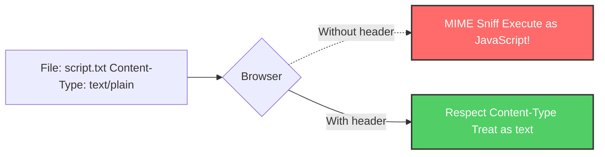

**Effect**: Browser respects declared Content-Type, won't guess.

#### X-XSS-Protection: 1; mode=block

**Purpose**: Enable browser's XSS filter

```mermaid
graph TB
    Input[User Input: &lt;script&gt;alert('XSS')&lt;/script&gt;] --> App[Application]

    App --> Response[Response includes unsanitized input]

    Response --> Browser{Browser XSS Filter}

    Browser -->|Header enabled| Block[Block rendering Show error page]
    Browser -.->|Header disabled| Execute[Execute script XSS attack!]

    style Block fill:#51cf66,stroke:#333,stroke-width:2px,color:#fff
    style Execute fill:#ff6b6b,stroke:#333,stroke-width:2px,color:#fff
```

**Effect**: Browser blocks detected XSS attempts.

**Note**: Modern browsers use Content Security Policy instead, but this provides backward compatibility.

#### Referrer-Policy: strict-origin-when-cross-origin

**Purpose**: Control referrer information sent to other sites

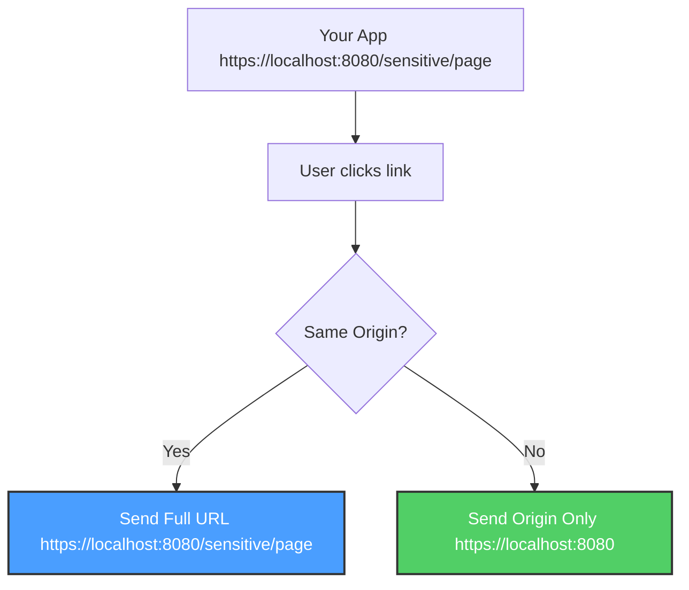

**Effect**: External sites only see your origin, not full URLs with sensitive info.

## Best Practices

### Development Environment

#### 1. Secrets Management

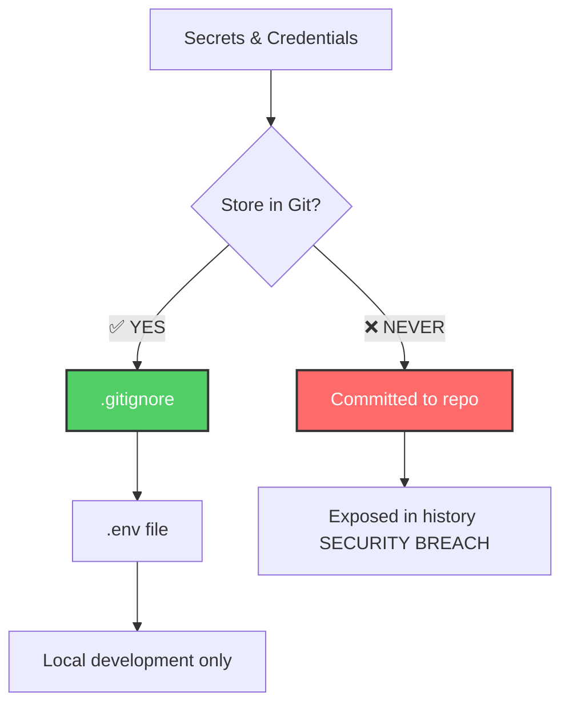

**Never commit:**
- `.env` files (already in `.gitignore`)
- Registry tokens
- API keys
- Passwords

**Use instead:**
- `.env.example` (template without secrets)
- Environment variables
- Secret management tools (for production)

#### 2. Network Binding

```bash
# ✅ GOOD: Localhost only
ports:
  - "127.0.0.1:8080:8080"

# ⚠️ ACCEPTABLE: All interfaces (for local network testing)
ports:
  - "0.0.0.0:8080:8080"
# But ensure firewall blocks external access!

# ❌ BAD: Never expose to internet
# No public IP binding
```

#### 3. Docker Security

```bash
# ✅ Keep Docker updated
docker --version

# ✅ Scan images regularly
docker scan dev-proxy:latest

# ✅ Review container logs
docker compose logs dev-proxy

# ✅ Monitor resource usage
docker stats dev-proxy
```

### Dependency Management

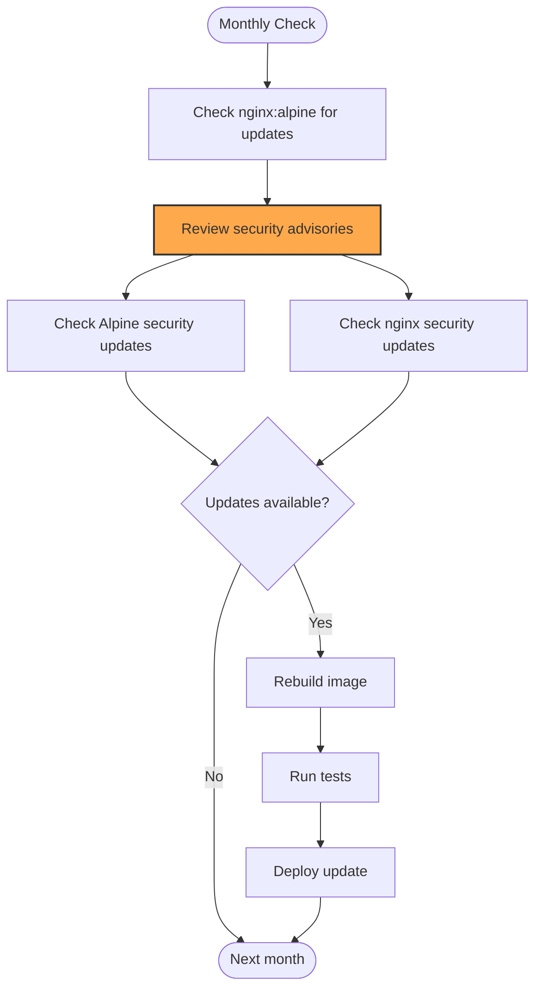

**Resources:**

- **Alpine Security**: https://alpinelinux.org/
- **Nginx Security**: https://nginx.org/en/security_advisories.html
- **Docker Official Images**: https://hub.docker.com/_/nginx

### Registry Security

#### Token Management

```bash
# ✅ GOOD: Set in environment, not committed
export DO_TOKEN=dop_v1_...

# ✅ GOOD: Rotate tokens regularly (every 90 days)
# Generate new token
# Update scripts
# Revoke old token

# ❌ BAD: Hardcode in scripts
DO_TOKEN="dop_v1_..." ./scripts/push-to-registry.sh
```

#### Registry Authentication

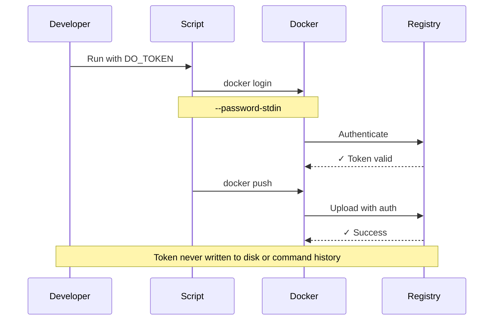

## Security Checklist

### Before Deploying Locally

- [ ] Using latest image version
- [ ] `.env` file not committed to git
- [ ] No secrets in configuration files
- [ ] Firewall configured correctly
- [ ] Docker up to date
- [ ] Only binding to localhost (or local network)

### Before Building Image

- [ ] Base image version pinned (not `latest`)
- [ ] No secrets in Dockerfile
- [ ] No unnecessary packages installed
- [ ] Configuration reviewed for security
- [ ] Tests pass (`./scripts/test.sh`)

### Before Pushing to Registry

- [ ] Image scanned for vulnerabilities
- [ ] Registry token rotated recently (< 90 days)
- [ ] Correct registry specified
- [ ] Tag follows semantic versioning
- [ ] Multi-arch build tested on both platforms

### Regular Maintenance

- [ ] Monthly: Check for base image updates
- [ ] Monthly: Review security advisories
- [ ] Quarterly: Rotate registry tokens
- [ ] Quarterly: Update documentation
- [ ] Annually: Security audit

## Vulnerability Reporting

See [SECURITY.md](../SECURITY.md) in the repository root for:

- How to report vulnerabilities
- Response timeline
- Disclosure policy
- Contact information

## Security Resources

### Official Documentation

- [OWASP Top 10](https://owasp.org/www-project-top-ten/)
- [Docker Security](https://docs.docker.com/engine/security/)
- [Nginx Security](https://nginx.org/en/docs/http/ngx_http_ssl_module.html#ssl_protocols)

### Security Tools

```bash
# Scan Docker images
docker scan dev-proxy:latest

# Audit npm packages (if using in app)
npm audit

# Check for known vulnerabilities
trivy image dev-proxy:latest
```

### Monitoring

```bash
# Check container logs for suspicious activity
docker compose logs -f dev-proxy

# Monitor resource usage
docker stats dev-proxy

# Check for failed health checks
docker inspect dev-proxy | jq '.[0].State.Health'
```

## Related Documentation

- [Architecture](Architecture) - Security architecture overview
- [Configuration](Configuration) - Secure configuration practices
- [Build Process](Build-Process) - Secure build practices
- [Troubleshooting](Troubleshooting) - Security-related issues
