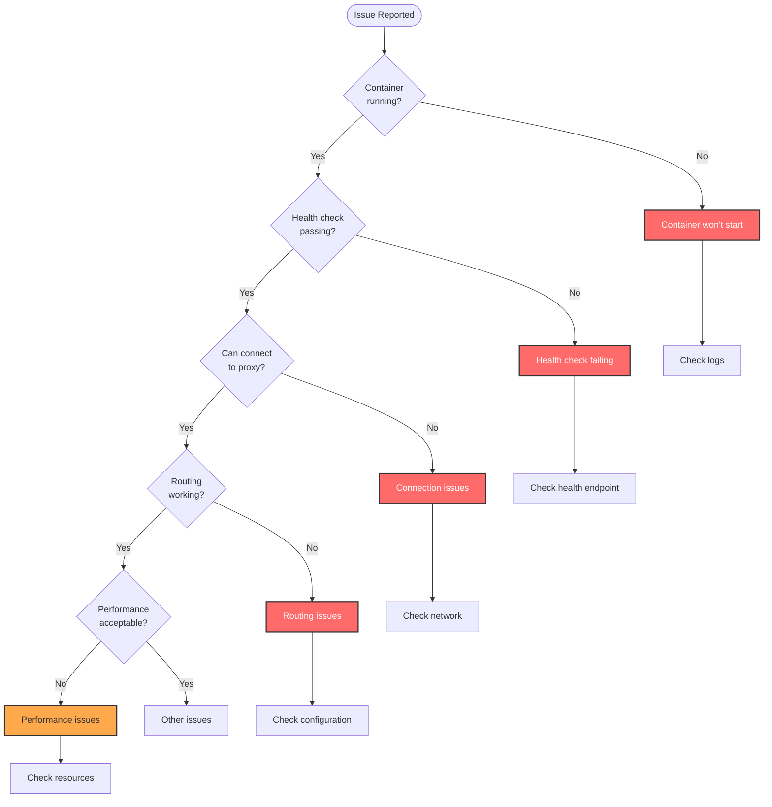
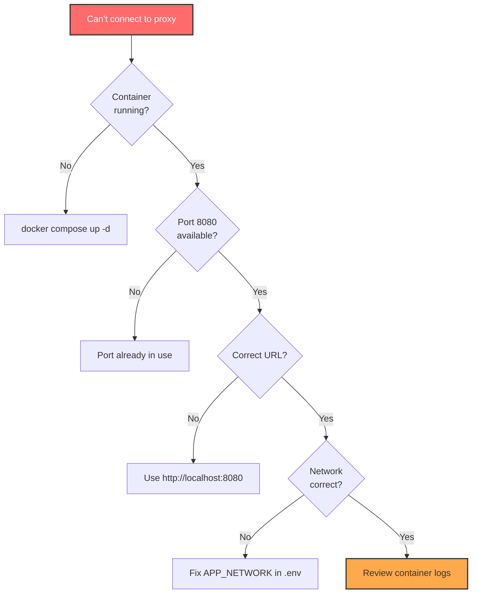
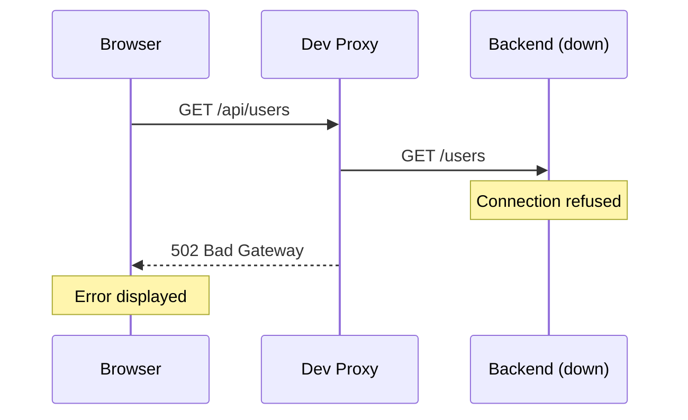
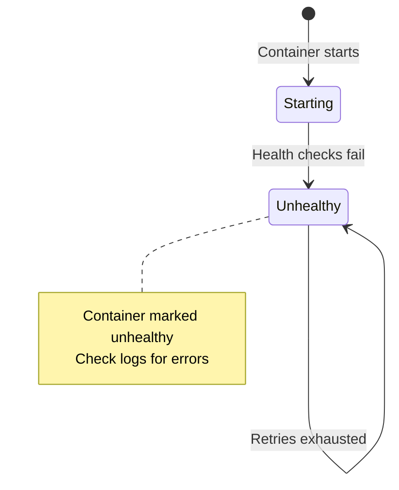
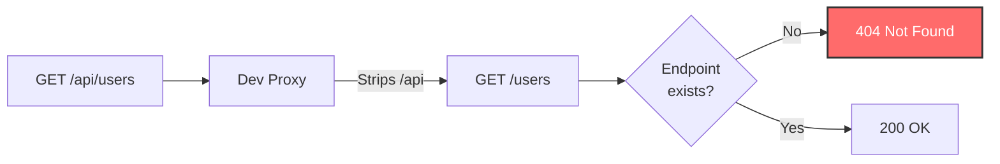
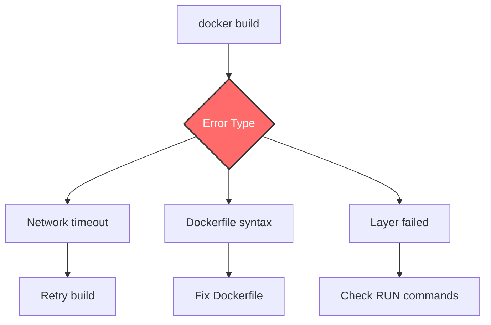
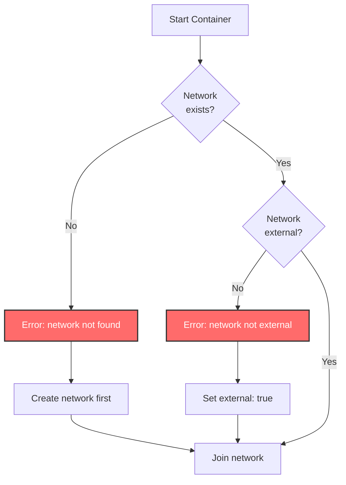
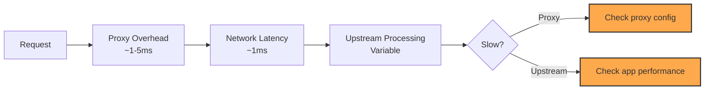

# Troubleshooting

This page provides solutions to common issues encountered when using Dev Proxy, along with diagnostic procedures and debugging techniques.

## Table of Contents

- [Quick Diagnostics](#quick-diagnostics)
- [Connection Issues](#connection-issues)
- [Health Check Issues](#health-check-issues)
- [Routing Issues](#routing-issues)
- [Build Issues](#build-issues)
- [Network Issues](#network-issues)
- [Performance Issues](#performance-issues)
- [Debugging Techniques](#debugging-techniques)

## Quick Diagnostics

### Diagnostic Flowchart



### Essential Commands

```bash
# Check container status
docker compose ps

# View logs
docker compose logs dev-proxy

# Test health endpoint
curl http://localhost:8080/health

# Check configuration
docker compose config

# Restart proxy
docker compose restart dev-proxy
```

## Connection Issues

### Issue: Can't Connect to Proxy

**Symptom**: Browser shows "Connection refused" or "Unable to connect"

#### Diagnosis Flow



#### Solution 1: Container Not Running

```bash
# Check status
docker compose ps

# Expected output:
# NAME        SERVICE     STATUS      PORTS
# dev-proxy   dev-proxy   Up          0.0.0.0:8080->8080/tcp

# If not running, start it
docker compose up -d

# Watch logs for errors
docker compose logs -f dev-proxy
```

#### Solution 2: Port Already in Use

```bash
# Find what's using port 8080
lsof -i :8080  # Mac/Linux
netstat -ano | findstr :8080  # Windows

# Option 1: Stop the conflicting service
docker stop <container-using-8080>

# Option 2: Use a different port
# Edit .env:
PROXY_PORT=8081

# Restart
docker compose down
docker compose up -d

# Access at http://localhost:8081
```

#### Solution 3: Wrong URL

**Common mistakes:**

| Wrong | Correct |
|-------|---------|
| `https://localhost:8080` | `http://localhost:8080` |
| `localhost` | `http://localhost:8080` |
| `http://0.0.0.0:8080` | `http://localhost:8080` |

### Issue: Can't Connect to Backend/Frontend

**Symptom**: Proxy works, but returns 502 Bad Gateway or 504 Gateway Timeout



#### Diagnosis

```bash
# 1. Check if app is running
docker compose -f /path/to/app/docker-compose.yml ps

# 2. Check if services are on the correct network
docker network inspect <APP_NETWORK>

# 3. Test connectivity from proxy to backend
docker compose exec dev-proxy curl -f http://${APP_BACKEND_HOST}:${APP_BACKEND_PORT}/health

# 4. Test connectivity from proxy to frontend
docker compose exec dev-proxy curl -f http://${APP_FRONTEND_HOST}:${APP_FRONTEND_PORT}/
```

#### Solutions

**1. App Not Running**

```bash
cd /path/to/your/app
docker compose up -d
```

**2. Wrong Network Configuration**

```bash
# Check your app's network name
docker network ls

# Update .env to match
APP_NETWORK=actual-network-name

# Restart proxy
docker compose restart dev-proxy
```

**3. Wrong Service Names**

```bash
# List services on the network
docker network inspect <APP_NETWORK> --format='{{range .Containers}}{{.Name}} {{end}}'

# Update .env with correct names
APP_BACKEND_HOST=correct-backend-name
APP_FRONTEND_HOST=correct-frontend-name

# Restart proxy
docker compose restart dev-proxy
```

## Health Check Issues

### Issue: Health Check Failing

**Symptom**: Container shows as "unhealthy" in `docker compose ps`



#### Diagnosis

```bash
# Check health status
docker inspect dev-proxy --format='{{.State.Health.Status}}'

# View health check logs
docker inspect dev-proxy --format='{{range .State.Health.Log}}{{.Output}}{{end}}'

# Manually test health endpoint
docker compose exec dev-proxy curl -f http://localhost:8080/health

# Check if curl is available (required for health checks)
docker compose exec dev-proxy which curl
```

#### Solutions

**1. Nginx Not Running**

```bash
# Check nginx process
docker compose exec dev-proxy ps aux

# If nginx not running, check logs
docker compose logs dev-proxy

# Check nginx config syntax
docker compose exec dev-proxy nginx -t
```

**2. Port Not Listening**

```bash
# Check if nginx is listening on port 8080
docker compose exec dev-proxy netstat -ln | grep 8080

# If not listening, check nginx configuration
docker compose exec dev-proxy cat /etc/nginx/conf.d/default.conf
```

**3. Curl Missing**

```bash
# Rebuild image (curl should be installed)
docker compose build --no-cache
docker compose up -d
```

## Routing Issues

### Issue: Frontend Requests Going to Backend

**Symptom**: Accessing `/` returns backend response instead of frontend

#### Diagnosis

```bash
# Test routing directly
curl http://localhost:8080/
curl http://localhost:8080/api/test

# Check nginx configuration
docker compose exec dev-proxy cat /etc/nginx/conf.d/default.conf

# Check environment variable substitution
docker compose exec dev-proxy env | grep APP_
```

#### Solution

```bash
# Verify .env configuration
cat .env

# Ensure correct values:
APP_FRONTEND_HOST=your-frontend-container
APP_FRONTEND_PORT=3000
APP_BACKEND_HOST=your-backend-container
APP_BACKEND_PORT=3001

# Restart to apply changes
docker compose down
docker compose up -d
```

### Issue: API Requests Return 404

**Symptom**: `/api/users` returns 404 from backend



**Cause**: Path rewriting - `/api` prefix is stripped

#### Solutions

**1. Backend expects full path `/api/users`**

Update nginx config:

```nginx
location /api/ {
    # Remove trailing slash to keep /api prefix
    proxy_pass http://${APP_BACKEND_HOST}:${APP_BACKEND_PORT};
}
```

**2. Backend route is different**

Check backend routes:

```bash
# View backend logs
docker compose -f /path/to/app/docker-compose.yml logs backend

# Test backend directly
docker compose exec dev-proxy curl http://${APP_BACKEND_HOST}:${APP_BACKEND_PORT}/users
```

## Build Issues

### Issue: Build Fails

**Symptom**: `docker compose build` or build scripts fail

#### Build Error Flow



#### Common Errors

**1. Network Timeout**

```bash
# Error: failed to fetch nginx:alpine
# Solution: Retry or check internet connection
docker compose build --no-cache
```

**2. Syntax Error**

```bash
# Error: unknown instruction: EXPSE
# Solution: Fix typo in Dockerfile
EXPOSE 8080  # Correct
```

**3. Package Not Found**

```bash
# Error: apk: curl-9999: not found
# Solution: Update package or remove version pinning
RUN apk add --no-cache curl
```

### Issue: Multi-arch Build Fails

**Symptom**: `build-multiarch.sh` fails

#### Diagnosis

```bash
# Check buildx is available
docker buildx version

# Check builders
docker buildx ls

# Create builder if needed
docker buildx create --name multiarch-builder --use
docker buildx inspect --bootstrap
```

#### Solutions

**1. Buildx Not Available**

```bash
# Update Docker to latest version
# Docker Desktop: Check for updates
# Linux: Update docker-ce package
```

**2. Platform Not Supported**

```bash
# Install QEMU for emulation
docker run --privileged --rm tonistiigi/binfmt --install all

# Verify platforms
docker buildx ls
```

## Network Issues

### Issue: Container Can't Join Network

**Symptom**: Error: "network not found" or "failed to create endpoint"



#### Solutions

**1. Network Doesn't Exist**

```bash
# List networks
docker network ls

# Create app's network (or start app first)
cd /path/to/app
docker compose up -d

# Verify network created
docker network ls | grep app-network
```

**2. Wrong Network Name**

```bash
# Find correct network name
docker network ls

# Update .env
APP_NETWORK=correct-network-name

# Restart
docker compose down
docker compose up -d
```

### Issue: DNS Resolution Fails

**Symptom**: Proxy can't resolve backend/frontend hostnames

```bash
# Test DNS resolution
docker compose exec dev-proxy nslookup ${APP_BACKEND_HOST}

# Test with dig
docker compose exec dev-proxy dig ${APP_BACKEND_HOST}
```

#### Solution

```bash
# Ensure services are on same network
docker network inspect ${APP_NETWORK}

# Should show dev-proxy, backend, and frontend

# If not, check docker-compose.yml networks configuration
```

## Performance Issues

### Issue: Slow Response Times

**Symptom**: Requests take longer than expected



#### Diagnosis

```bash
# Test proxy overhead
time curl http://localhost:8080/health
# Should be < 10ms

# Test backend directly
time curl http://localhost:3001/api/endpoint
# Compare with proxied time

# Check proxy logs for errors
docker compose logs dev-proxy | grep error
```

#### Solutions

**1. Increase Timeouts**

Edit `nginx.conf.template`:

```nginx
proxy_connect_timeout 120s;
proxy_send_timeout 120s;
proxy_read_timeout 120s;
```

**2. Check Resource Limits**

```bash
# Check container resources
docker stats dev-proxy

# Increase limits in docker-compose.yml:
deploy:
  resources:
    limits:
      cpus: '1.0'
      memory: 512M
```

### Issue: High Memory Usage

```bash
# Check memory usage
docker stats dev-proxy

# If high, check worker processes
docker compose exec dev-proxy ps aux

# Restart to clear memory
docker compose restart dev-proxy
```

## Debugging Techniques

### Enable Debug Logging

**1. Nginx Debug Logs**

Create `docker-compose.override.yml`:

```yaml
version: '3.8'

services:
  dev-proxy:
    command: ["nginx", "-g", "daemon off; error_log /var/log/nginx/error.log debug;"]
    volumes:
      - ./logs:/var/log/nginx
```

**2. View Detailed Logs**

```bash
docker compose logs -f dev-proxy

# With timestamps
docker compose logs -f -t dev-proxy

# Last 100 lines
docker compose logs --tail=100 dev-proxy
```

### Interactive Debugging

```bash
# Access container shell
docker compose exec dev-proxy sh

# Inside container:
ps aux              # Check processes
netstat -ln         # Check listening ports
cat /etc/nginx/conf.d/default.conf  # View config
env                 # Check environment variables
curl localhost:8080/health  # Test internally
```

### Test Requests

```bash
# Test with verbose output
curl -v http://localhost:8080/

# Test with headers
curl -H "Authorization: Bearer token" http://localhost:8080/api/users

# Test with specific method
curl -X POST -d '{"test":"data"}' -H "Content-Type: application/json" http://localhost:8080/api/endpoint

# Save response headers
curl -D headers.txt http://localhost:8080/
cat headers.txt
```

### Network Debugging

```bash
# Inspect network
docker network inspect ${APP_NETWORK}

# Test connectivity between containers
docker compose exec dev-proxy ping ${APP_BACKEND_HOST}

# Trace route
docker compose exec dev-proxy traceroute ${APP_BACKEND_HOST}

# Check DNS
docker compose exec dev-proxy nslookup ${APP_BACKEND_HOST}
```

### Configuration Validation

```bash
# Validate docker-compose.yml
docker compose config

# Validate nginx config
docker compose exec dev-proxy nginx -t

# View processed nginx config
docker compose exec dev-proxy cat /etc/nginx/conf.d/default.conf

# Check environment variable substitution
docker compose exec dev-proxy env | grep APP_
```

## Common Error Messages

### Error: "Bind for 0.0.0.0:8080 failed: port is already allocated"

**Solution**: Port 8080 is in use

```bash
# Find and stop conflicting container
docker ps | grep 8080
docker stop <container-id>

# Or use different port
PROXY_PORT=8081 docker compose up -d
```

### Error: "network not found"

**Solution**: App network doesn't exist

```bash
# Start app first
cd /path/to/app
docker compose up -d

# Or create network manually
docker network create ${APP_NETWORK}
```

### Error: "502 Bad Gateway"

**Solution**: Backend is unreachable

```bash
# Check backend is running
docker compose -f /path/to/app/docker-compose.yml ps backend

# Check backend hostname
docker compose exec dev-proxy ping ${APP_BACKEND_HOST}

# Test backend endpoint
docker compose exec dev-proxy curl http://${APP_BACKEND_HOST}:${APP_BACKEND_PORT}/health
```

### Error: "504 Gateway Timeout"

**Solution**: Backend is slow to respond

```bash
# Increase timeout in nginx.conf.template
proxy_read_timeout 120s;

# Check backend performance
docker compose -f /path/to/app/docker-compose.yml logs backend
```

## Getting Help

If you're still experiencing issues:

1. **Check Existing Issues**: [GitHub Issues](https://github.com/softwarewrighter/dev-proxy/issues)
2. **Review Documentation**:
   - [Architecture](Architecture)
   - [Configuration](Configuration)
   - [Request Flow](Request-Flow)
3. **Create New Issue**: Include:
   - Output of `docker compose config`
   - Container logs: `docker compose logs dev-proxy`
   - Error messages
   - Steps to reproduce

## Troubleshooting Checklist

Before asking for help, verify:

- [ ] Running latest version of Dev Proxy
- [ ] Docker and Docker Compose are up to date
- [ ] `.env` file is configured correctly
- [ ] App is running and healthy
- [ ] Network name matches app's network
- [ ] Service names match container names
- [ ] Port 8080 is available (or different port configured)
- [ ] Health check passes: `curl http://localhost:8080/health`
- [ ] Logs checked for errors
- [ ] Configuration validated: `docker compose config`

## Related Documentation

- [Architecture](Architecture) - Understanding the system design
- [Configuration](Configuration) - Configuration options
- [Request Flow](Request-Flow) - How requests are processed
- [Build Process](Build-Process) - Build and test issues
- [Security](Security) - Security-related troubleshooting
